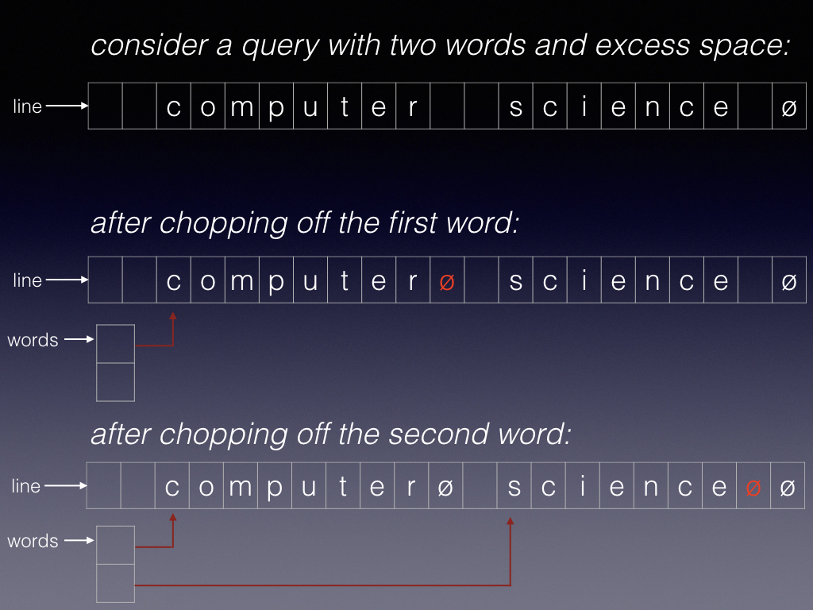

**Due Friday, May 12, at 10pm**

In this lab you'll continue the Tiny Search Engine (TSE) by coding the Querier according to the [Querier Requirements Spec](REQUIREMENTS.html).

* TOC
{:toc}

## Preparation

 1. Start with the same Gitlab project you used for Labs 4-5.
*Before you begin*, make sure you submitted Lab 5 correctly: you tagged the submitted version with `lab5submit`, [as instructed]({{site.labs}}/Lab5/#howsubmit), and pushed that tag to your Gitlab remote.

 2. Check to ensure your local repo is clean with `make clean` and everything has been committed and pushed according to `git status`.
If you have files that need to be committed, or commits that should be pushed, do that now.
(oops - were those supposed to be part of your Lab 5 submission? See the first step above.)

 3. **Do not proceed** if you have uncommitted changes or unpushed commits.
Seek help if you need to sort out your repo and Gitlab.

 3. Pull the updated and additional files from the upstream master (the TSE starter kit) into your local repository:
`git pull upstream master`
(this works if you earlier followed the [instructions from Section meeting]({{site.sections}}/05/)).
> [Here](https://gitlab.cs.dartmouth.edu/CS50/tse/compare/341328cc0ba0501a0f53eabace60a5cdbbd5b762...HEAD) you can see the changes that will happen when you run this command - all the changes made to the starter kit since it was released.

 4. Commit and push your changes; perhaps tag this commit for easy reference later: `git commit -a; git tag lab6start; git push --tags`.

 5. Check again to be sure your Gitlab repo is ***private*** (not *internal* or *public*).
Visit your repo on Gitlab, click on *Settings*, and scroll down to *Project Visibility*.


## Assignment

Write the *querier*, third sub-system of the Tiny Search Engine.
Please follow the [CS50 coding style guidelines]({{site.resources}}/CodingStyle.html) and the [Querier Requirements Spec](REQUIREMENTS.html), and make good use of our abstract data structures.

 1. In the `querier` subdirectory, write
	 * a program `querier`;
	 * a `Makefile` to build `querier`;
	 * a short file `README.md` to provide any special information about compiling or using your querier;
	 * a file `DESIGN.md` to provide the Design Spec for querier, drawing inspiration from the [lecture notes]({{site.lectures}}/indexer/);
	 * a file `IMPLEMENTATION.md` to provide the implementation spec and testing plan for querier;
	 * a file `TESTING.md`, telling the grader how you tested your querier (see [about testing](#testing) below);
	 * a `.gitignore` file telling Git to ignore the binary files (libraries, executables) in this directory.

 2.  Your program shall leverage common code from `common.a` in the `../common` directory:
	 * a module `index.c` that contains all the logic for saving and loading index files (this module is common between the Indexer, Querier, and indextest);
	 * a module `pagedir.c` that contains all the logic for saving pages to a crawler output directory, for loading pages from a crawler output directory (this module is common between the Crawler and Indexer);
	 * (optionally) a module `word.c` that implements `NormalizeWord` (this module is common between the Indexer and Querier);
	 * a `Makefile` that builds `common.a` for use by the programs;
	 * a short `README.md` file explaining how to build `common.a`;
	 * a `.gitignore` file telling Git to ignore the binary files (libraries, executables) in this directory.

 3. Review your top-level `README.md` and `Makefile` to update as needed.


### Submission - what {#whatsubmit}

In this lab you shall edit or add files as described above.
***You must arrange your directory like ours, so we can better navigate and test your code.***  Of course, you may have additional files - test scripts, test output, code you've chosen to break into multiple files.
Here is the solution's [directory structure]({{site.labs}}/Lab5/tse-tree.txt); it includes some of the optional files and some of the testing files, which may not be present in your solution.
The point is that your code must be organized in the same *directory* structure.

*You shall NOT modify any of the code we provide in `libcs50`*.

*You shall NOT include any data files produced by the crawler or indexer, or any binary/object files produced by the compiler, backup files, core dumps, etc.*

### Submission - how {#howsubmit}

When you are ready for final submission,

* **Add** all required files using an appropriate `git add` commandline.
* **Commit** all changes using an appropriate `git commit` commandline.
* **Tag**: `git tag lab6submit`
* **Push**: `git push --tags` to ensure the tags are pushed to the remote.
See [more about tags]({{site.lectures}}/git/tags.html).

Use your web browser to view your remote on Gitlab and make sure there is a tag `lab6submit` and the files associated with that tagged commit include everything we'll need to grade your lab.

We will clone your repo at 0h, 24h, 48h, and 72h after the original deadline.
We will start grading when we first see one with tag `lab6submit`, and judge it late if that tag was added after the deadline.
To avoid confusion, *please blitz the team `cs50 AT cs.dartmouth.edu` if you want a late submission to be graded instead of your on-time submission.*

***Your entire codebase must compile with `make` from the top-level directory and produce no compiler warnings.***  If we find that your code will not compile, or has **segmentation faults**, we will send it back to you as soon as we can for repair; recall the [grading policy]({{site.logistics}}/#crashes).

We will run your querier on our own set of test data.

We will run `valgrind` on your program to look for memory leaks; you will lose points for memory leaks or memory errors.

### Extensions

If you want to claim your 24h extension, create a file `EXTENSION` at the top-level directory of your repository.
Don't forget to `git push` *(before the deadline!)* so we will see the file.
For example,

```bash
$ touch EXTENSION
$ git add EXTENSION
$ git commit -m "extension request"
$ git tag lab6submit     # add tag, as above
$ git push --tags        # push to gitlab, including tags
```

Use your web browser to view your remote on Gitlab and make sure there is a tag `lab6submit` and that its files include `EXTENSION`.

When you are ready to submit your code, remove `EXTENSION` as follows, *update your submission tag*, and push to Gitlab:

```bash
$ git rm EXTENSION
$ git commit -m "ready for grading"
$ git push --delete origin lab6submit # remove the tag from remote
$ git tag -f lab6submit  # move the local tag forward to this commit
$ git push --tags        # push to gitlab remote, including tags
```

Use your web browser to view your remote on Gitlab and make sure there is a tag `lab6submit`, that its files do *not* include `EXTENSION`, and its files include everything we'll need to grade your lab.


## Grading {#grading}

Lab 6 is scored on the basis of 100 points, with Delivery, Documentation, Style, Testing comprising most of the points.

"Functionality" represents 40/100 points.
In recognition that you might find it best to start simple and slowly enhance your solution as you get the simpler version working, you can earn points as follows:

 * 10 points if your querier prints the set of documents that contain all the words in the query; you may treat operators ('and', 'or') as regular words.
 * 20 points if your querier also supports 'and' and 'or' operators, but without precedence (in mathematical terms, it treats them as *left associative, equal precedence* operators).
 * 30 points if your querier also supports 'and' precedence over 'or'.
 * 40 points if your querier also prints the document set in decreasing order by score, thus meeting the full specs.

Partial credit is available, of course, per the judgement of the grader, but above is the coarse-grain rubric.

## Hints and tips {#hints}

Processing a query and ranking the results are tricky.
We encourage you to start with a simplified case, test it thoroughly, then enhance.
Easier to code, to test, and to debug, and when facing a deadline it's nice to have a less-functional program that works than a full-functional program that doesn't work.
See the above section on [Grading](#grading) regarding the points allocated as you achieve higher levels of functionality.

### Review the lecture notes

There are some examples and design tips in the [lecture notes]({{site.lectures}}/querier/).

### Hashtable

How big should your hashtable be?
Well, you can know how many words it will store - because the index file has one word per line, and you can count the number of lines in the index file before creating an index data structure and before loading the file into the structure.
Just think about how the hash-table size (in slots) might relate to the number of words it will need to store.

### Parsing queries

We strongly recommend that your code read the entire query (a line of input) into a single string, then *tokenize* the query string.
That is, you should write a function that takes a string and builds an array of words; it should use white space (space or tab) as the delimiter; each word can be normalized (lower-cased) and checked for illegal characters before being added to the array.
See [one approach](#chopping) at bottom.

Now that all the character-by-character parsing is behind you, and you have an array of words, you can step through the array to print a *clean query*, that is, with no extraneous spaces and all letters in lower case.

You can then step through the array according to the structure defined in the BNF.
Two tips:

 * Validate the basic structure: neither the first or last word may be an operator, and two operators may not be adjacent.
If valid, proceed to next step; otherwise print a suitable error message.
 * Structure your code to follow the structure of the grammar, which has two non-terminals (`query` and `andsequence`), to write a function that handles each.
	 * One function to return set of documents that satisfy an `andsequence`, looping over words; accumulate an answer (like a running product) as you go.
	 * Another function to return set of documents that satisfy a `query`, looping over calls to the above function for each `andsequence`; accumulate an answer (like a running total) as you go.

> See [Lecture notes]({{site.lectures}}/querier/index.html#expressions) for more hints about how this might work.


### Combining results

Suppose you have one `counters` object representing the set of documents in which a given word appears, and another `counters` object representing the set of documents in which another word appears; each counter set is really a set of (docID, count) pairs.
How do you combine them?
Recall [Lecture]({{site.lectures}}/iterators/).

If you are processing `wordA AND wordB`, the set of documents that match *both* words is the *intersection* of the two sets, and the score for each document (per the specs) is the *minimum* of the count for each document.
So you need a way to intersect two `counters`; we recommend iterating over one set and, for each item, checking whether that document exists in the other set; update the first set according to what you find.
You can use `counters_iterate`, `counters_get`, and `counters_set` to do this, without modifying your `counters` module.

If you are processing `wordA OR wordB`, the set of documents that match *either* word is the *union* of the two sets, and the score for each document (per the definition above) is the *sum* of the count for each document.
So you need a way to union two `counters`; we recommend iterating over the second set and, for each item, checking whether that document exists in the first set; update the first set according to what you find.
Again, you can use `counters_iterate`, `counters_get`, and `counters_set` to do this, without modifying your `counters` module.

While processing an `andsequence` you can compute a 'running product', that is, a `counters` object that represents the intersection of everything seen so far in the sequence.

When processing a query, that is, a disjunction of `andsequence` results, you can similarly compute a 'running sum', that is, a `counters` object that represents the union of everything seen so far in the sequence.


### Ranking results

After parsing and interpreting a query, you will likely have a `counters` object representing the score for each satisfying document.
The `counters` module does not have a 'sort' method or a way to iterate over the items in sorted order.
We suggest you use  `counters_iterate()` in which the `itemfunc` inserts the items into a new array of structs, each struct representing one satisfying document (docID, score).
Use `counters_iterate` twice - once to count the number of items in the set so you can allocate an appropriate-sized array, and again to stuff each item into the new array.
If your `itemfunc` uses an insertion-sort approach to drop the new item into the array so the array is sorted in decreasing-score order, you end the iteration with a nicely sorted array of structs.
Then you can simply loop over the array to print out the list of documents.

### Testing your querier {#testing}

Your querier reads queries from stdin, one per line.
You can test it interactively, but to do thorough and repeated testing you can write a collection of little files, each of which contains one or more queries to your querier, and run commands like `./querier < testquery`.
You might write a short bash script to run the querier through several such test files.
That script might even compare the output to known-good output, for regression testing.

You are welcome (but not required) to use the `fuzzquery.c`, provided in the updated starter kit, for testing your querier.
Again, you might write a short bash script and/or Makefile rules to help you run tests using this program.
*If you choose to use this program, you will need to change the `-std` switch in the `CFLAGS` definition in your `Makefile` as follows*

```make
CFLAGS = -Wall -pedantic -std=gnu11 -ggdb $(FLAGS) -I$C -I$L
```

If your indexer never quite worked, never fear.
You do not need a working indexer to write or test your querier.
Try your querier on the indexer's output, in `~cs50/data/tse-output/`.

### Chopping a string into array of strings {#chopping}

Here's a nice trick for breaking a single string `char* line` into an array of strings `char* words[]`.
In the example below, the query has two words, and there are leading spaces, separating spaces, and trailing space, terminated by a null.
Because in C a "string" is just a pointer to an array of characters terminated by a null `\0` character, we can chop this single string into multiple strings by replacing two of the spaces with nulls, and recording a pointer to the beginning of each word.
We don't need to allocate any memory for these new strings, or copy these strings - they stay right where they are.



To make this happen, think about sliding two pointers along the array, starting at `line`.
One pointer might be `char* word` and you slide it over to the first non-space; the other pointer might be `char* rest` and you slide it from `word` to the first non-letter.
Squash that character `*rest` with a null, and you've created a null-terminated string starting at `word`.

*Think carefully* about the edge cases, as you construct the loops and slide the pointers.

### ctype

You may find the functions `isalpha()` and `isspace()` useful; read the man page.
They are from the `ctype.h` package.
