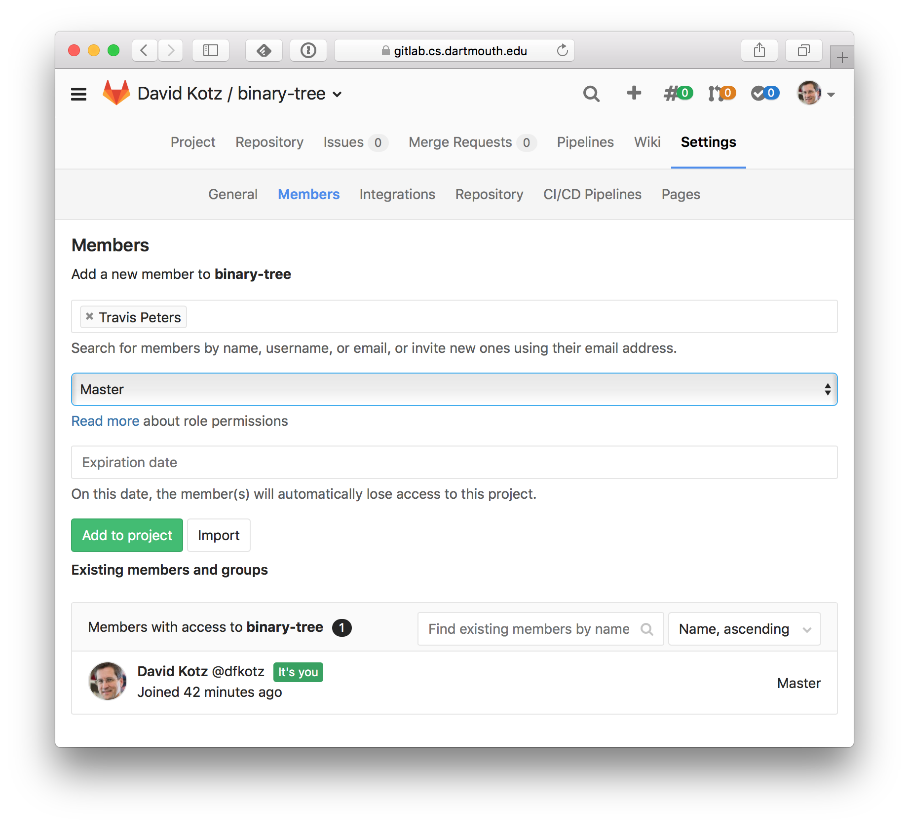

### Goals

* to gain experience with git and Gitlab
* to create and share a repo within your team

### Activity

The lecture notes has a section about the [CS Gitlab Server](index.html#cs-gitlab) that shows a similar (though not identical) activity.

1.  Use a browser to go to [`https://gitlab.cs.dartmouth.edu/`](https://gitlab.cs.dartmouth.edu/)
2.  Each member of your group that doesn't already have one should ***create a Gitlab userid that is identical to your CS login name***.
3.  When the GitLab userid is created, go back and login.
4.  ***One*** member of your group should follow steps 1 through 9 in the [CS Gitlab Server]({{site.lectures}}/git/index.html#cs-gitlab) section of today's lecture notes. 
5.  After the project has been created, the ***same*** person should click on *Settings* and then *Members*; this page allows you to share the repo with other Gitlab users.
  Type the usernames of each of your group members and pick *Master* from the role menu, then click *Add to project*.
  Below, I'm adding Travis as a Master on my Binary-tree repo: .
6.  ***Other*** members of your group should then receive an email message confirming their addition to this repo.
  They should click the link in that message to visit the repo in the browser.
7.  ***All*** members of your group should then click on the repo name (right near the top of the page; in my example, it's *binary-tree*) to pop back to the home page for this repo.
8.  ***Important:*** Click on the `SSH` pop-up to change it to `HTTPS`.
9.  Scroll down to see the command-line instructions for using this project: 
10.  Before you proceed, copy the two *Git global setup* commands and paste them into a Terminal window.
  While you're at it, run two more commands:
  * `git config --global push.default simple`
  * `git config --global core.editor emacs`
  * (or vim, if you prefer it to emacs)
11.  Back to the new project.
   Since this is a brand-new project, you have no repository on your local computer (whether that be your laptop or flume).
   Look at the instructions under *Create a new Git repository.*
   Copy the `git clone` command you see there.
12.  Go to your Terminal window, and `cd ~/cs50`, your usual workspace for this class.
   Paste the `git clone` command.
   This command "clones" the remote repository (the one on Gitlab) into a new subdirectory.
13.  Enter your Gitlab username and password.
   It should proceed to create the local repository.
14.  ***One*** member of your group should create and push a `README.md` file.
   (If you prefer plaintext, just call it `README`.) The Gitlab page lists the commands to add an empty `README.md` file but you might want to write *something* in that README!
15.  Meanwhile, ***Other*** members of the group should each create a file `ABOUT-me.md` where they replace `me` with their name.
   (For example, I would create `ABOUT-David.md`.
   In the file they should write a sentence describing themself.
   Then,
   * `git add ABOUT-me.md` (with the appropriate filename)
   * `git commit ABOUT-me.md` (an editor will open so you can type a commit message)
   * `git push` (you may need to enter your Gitlab password)
16.  Back in the browser, refresh the repo's home page - you should all see the new README.
   If you click on *Files* you should see all the other files people added to the repo.
17.  ***All*** members of the group should `git pull` in their Terminal window - which should download all the files created by others to their local copy of the repo.

You now have a shared repo for use by your group!

### Tips

* After class, you may want to run those four global configuration commands on both your laptop and on flume, and install the `~/.gitignore` file on both your laptop and flume, as described above.
* Check out [Markdown]({{site.resources}}/#markdown) - it's easy to learn.
* [Why is Git always asking for my password?](index.html#why-is-git-always-asking-for-my-password)
