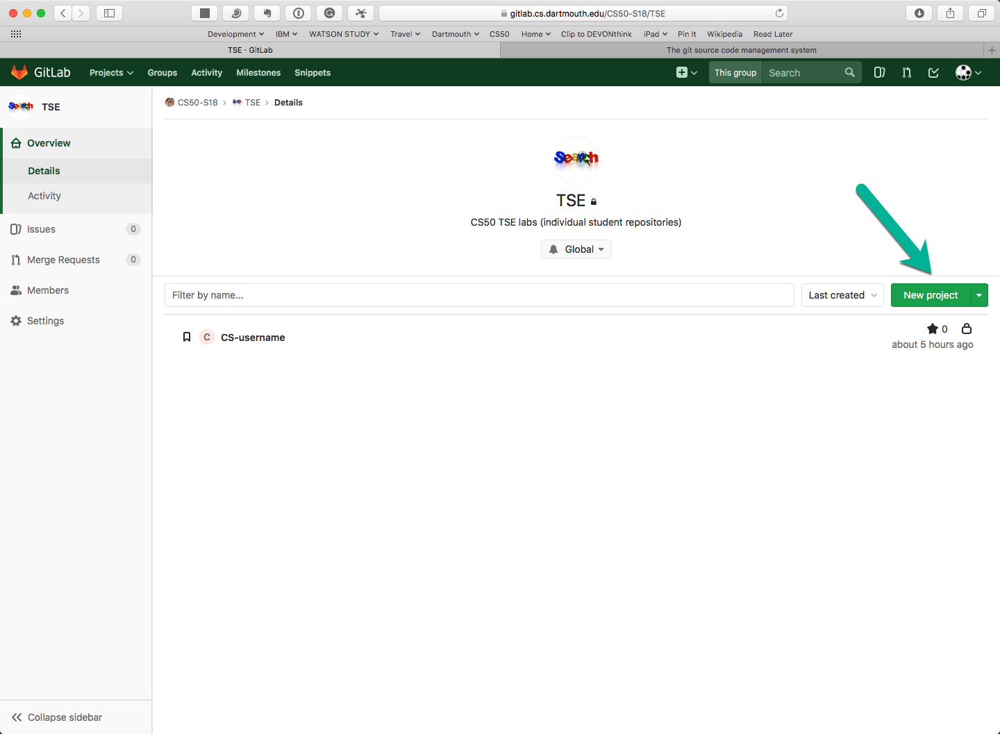
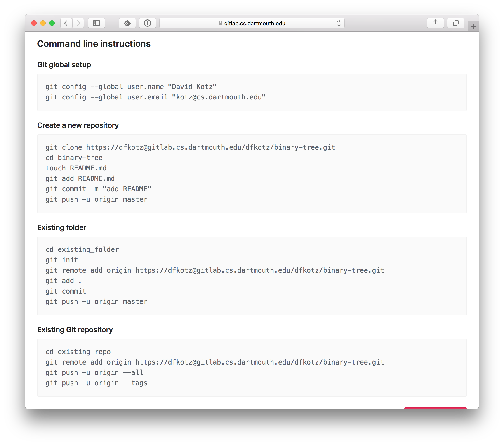

### Goals

* explore version control
* learn to use **Git**
* learn to use **Gitlab**

<!-- Today's Terminal [script](script.txt) shows some of the live examples - though only the Terminal side of the demo. -->

## Version control systems

Up to this point in your software engineering career, many of your programming projects will have been small, individual endeavors.
As software matures it often grows in complexity, as bugs are fixed, features are added, and the number of contributing developers increases.
Managing this complexity becomes a mammoth task that crushes many fledgling startups.
A similar fate is in store for projects that lack reliable version control (*we received a bug report on version 1.1 ... what WAS in version 1.1?*).
The ability to easily back out changes, or to accept only a subset of a group of changes, especially in a team environment, is also essential and it encourages experimentation.
Another software development practice that version control aids is *code reviews:* proposed changes may be examined before being incorporated into the master source code repository.
Tools like Git give programmers the ability to branch away from the main development track to try out a new feature or debug a quick fix, and later merge in the changes later or abandon them entirely.
Finally, Version Control Systems also serve as a form of backup ... just in case.

Some solo programmers might feel they don't need version control.
This is shortsighted ... as the sole person doing the work, with no support or backup team, these folks need version control even more!

Version control systems (VCS) come in many flavors.
You may have heard of some of the open-source incarnations, such as [Concurrent Versions System](http://cvs.nongnu.org) (`cvs`), [Mercurial](http://mercurial.selenic.com) (`hg`), or [Subversion](http://subversion.apache.org)  (`svn`).
While these systems differ in implementation, they all provide methods to manage resources, such as tracking, reverting, and merging changes.
**Git** is an open-source distributed version control system (DVCS).

Any text-based files can be managed by a VCS.
Source code, configuration files, SQL scripts, test scripts, documentation written using LaTeX or Markdown, XML, web pages, and more assets are easily maintained in a VCS.
(I store this website in Gitlab using git!) Files that are not human-readable (like Word or PDF files, or images) can be problematic, but can sometimes be stored in a VCS, without the benefit of some of the text-based tools.

There are two primary groups of Version Control Systems:

-   centralized, such as Subversion and ClearCase, which generally require a network connection for operation, and
-   decentralized, such as Mercurial and git, which do not require a network connection.
In fact, these systems *always* have a complete local version of the repository.

We will be using [Git](http://git-scm.com).
The Git project was originally developed by (and [somewhat named after](http://en.wikipedia.org/wiki/Git_(slang))) Linus Torvalds to manage the Linux kernel (15 million LOC).
Many open-source and commercial projects currently rely on Git, including the Linux kernel, Google's Android OS, and the MacOSX package manager Homebrew.

We will be using Git on the CS systems machines using a CS-managed Git server called Gitlab.
We will not cover installation and setup of Git on your personal laptop or the use of third-party Git-related applications such as [Github](https://github.com), [BitBucket](https://bitbucket.org), or [SourceTree](https://www.sourcetreeapp.com/).
The enterprising student may explore these (and other advanced) topics on their own.
You will find several free books and interactive tutorials on the [resources page]({{site.resources}}).
I particularly recommend *Pro Git* by Scott Chacon and Ben Straub (available free [online](http://git-scm.com/book/en/v2)).


## Why Version Control

Imagine the following scenario: You have a term paper to write.
So, being a diligent student, you start early by writing a rough draft, saved as `paper.doc`.
As you explore your topic, you think, "I like what I have, but what if I added..." You do not want to lose your current progress, so you copy your paper to a new file `paper2.doc` and begin exploring new ideas.
As ideas come and go, you continue to replicate and rename your files.
You reach the final week of classes with 5 different documents, each containing something you want to keep.
You create a new file, named `final.doc`, that will contain all of the disparate pieces of thought linked together.
Before the deadline, you realize you want to rework the intro, and thus create `final2.doc`.
In the end, you submit something that looks like `final2-good-final.doc`.
Now imagine you had to write this paper together with others?

Version control systems are designed to alleviate the hardships of managing resources, like source code files or term papers.
When using a VCS, files are tracked so that any changes can be recorded.
In the simple example above, you ended up with multiple files, some likely sharing large portions of the same text.
In some VCS, storage space is saved by only saving changes, or "deltas", to files.
These changes can be logged and timestamped, so that going back to the version last Tuesday before 9 PM would be very easy.
In the previous example, you wanted to combine parts of multiple files.
This concept is known as *merging*.
In addition to tracking files, and allowing easy reversion, VCS often have capabilities for easy merging.

When collaborating with multiple users, VCS come in two varieties: client-server and distributed.
In the client-server model, the central repository is shared amongst all users.
Here terms like "checkout" and "lock" come into play.
When a user wants to edit a file, they checkout that file.
This locks the file from being edited by any other users at the same time.
Some VCS allow "stealing" of files for urgent or priority changes, but in general if a user has control, then no one else can have that file until they check it in.
A common complaint with client-server systems is their being slow, because every operation must communicate with the central server and it is not generally safe for multiple users to modify the same files.
CVS and SVN are examples of the client-server model.
In distributed version-control systems, each user maintains their own local repository and changes are shared periodically amongst all other users.
Merge conflicts can arise when multiple users modify the same file, and many VCS provide advanced features to simplify this process.
Mercurial and Git are among the more popular distributed version control systems, both known for their speed and flexibility.

## Git Configuration

Before you can start using Git, you will need to configure your development environment.
Git stores environment settings in three different files:

-   `/etc/gitconfig` --- contains settings for all users on a system
-   `~/.gitconfig` --- contains user-specific settings
-   `project/.git/config` --- contains project-specific settings

Project settings override user settings, which in turn override system settings.
There are many configuration options, but at a minimum you need to tell Git who you are (your name) and how to contact you (your email).
Although you can edit those files with an editor, Git provides a command `config` for setting common parameters, as shown below.
Here I also set my preferred editor to `emacs`.

```bash
[kotz@flume ~]$ git config --global user.name "David Kotz"
[kotz@flume ~]$ git config --global user.email "kotz@cs.dartmouth.edu"
[kotz@flume ~]$ git config --global core.editor emacs # or vim, BBedit, ...
[kotz@flume ~]$ git config --global color.ui true  #if you like colors
[kotz@flume ~]$ git config --global push.default simple
```

You can view your current settings with the `--list` option.
The last two options may be useful if you want certain commands to color their output.

```bash
[kotz@flume ~]$ git config --list
user.name=David Kotz
user.email=kotz@cs.dartmouth.edu
core.editor=emacs
color.ui=true
push.default=simple
[kotz@flume ~]$ 
```
As you can see, the `--global` option writes your user specific settings to `~/.gitconfig`.

```bash
[kotz@flume ~]$ cat ~/.gitconfig
[user]
	name = David Kotz
	email = kotz@cs.dartmouth.edu
[core]
	editor = emacs
[color]
	ui = true
[kotz@flume ~]$ 
```

If you want to dig further, a self-documenting `.gitconfig` starting point may be found [here](https://gist.github.com/rab/4067067).

## Gitting Help

You can always get help:

```bash
[kotz@flume ~]$  man git
[kotz@flume ~]$  git help <command>
```

and there are many tutorials and references on the Internet; see our [Git Resources]({{site.resources}}#git) page.

## Creating a repository

A *repository*, called *repo* for short, is a data structure that contains all of the information needed to manage a project.
This often includes the project files and resources themselves, as well as any meta-data used by the VCS to manage them.
Let's see how to create a Git repo.

### create a new (empty) local repository

You always need a local repository to work with git.
When starting a new project from the beginning, you can either create a repo and fill it up or create a repo in an existing directory that already contains files.

```bash
[kotz@flume ~]$ cd cs50/labs
[kotz@flume ~/cs50/labs]$ mkdir labx
[kotz@flume ~/cs50/labs]$ cd labx
[kotz@flume ~/cs50/labs/labx]$ git init
Initialized empty Git repository in /net/nusers/kotz/cs50/labs/labx/.git/
[kotz@flume ~/cs50/labs/labx]$ ls -a
./  ../  .git/
[kotz@flume ~/cs50/labs/labx]$ 
```

Notice that Git created a hidden directory `.git` - you should not mess with any of its contents.

### create a repository in an existing development directory

Suppose you want to begin using a VCS after a project already had a lot of files in an existing directory tree.

```bash
[kotz@flume ~]$ cd cs50/labs/tree6
[kotz@flume ~/cs50/labs/tree6]$ git init   # initialize the repo
Initialized empty Git repository in /net/nusers/kotz/cs50/labs/tree6/.git/
[kotz@flume ~/cs50/labs/tree6]$ git add .  # recursively add the current directory
[kotz@flume ~/cs50/labs/tree6]$ git status # print current status
On branch master

Initial commit

Changes to be committed:
  (use "git rm --cached <file>..." to unstage)

	new file:   Makefile
	new file:   tree.c
	new file:   tree.h
	new file:   treetest.c

[kotz@flume ~/cs50/labs/tree6]$ git commit -m "Initial commit of tree code"
[master (root-commit) ef37181] Initial commit of tree code
 4 files changed, 285 insertions(+)
 create mode 100644 Makefile
 create mode 100644 tree.c
 create mode 100644 tree.h
 create mode 100644 treetest.c
[kotz@flume ~/cs50/labs/tree6]$ git status  # print current status
On branch master
nothing to commit, working directory clean
[kotz@flume ~/cs50/labs/tree6]$ git --no-pager log --oneline --decorate --graph --all  # pretty-print the history of commits
* ef37181 (HEAD -> master) Initial commit of tree code
[kotz@flume ~/cs50/labs/tree6]$ 
```

## Files in git

git treats all content as being in one of three states:

-   ignored - git never even looks at it
-   untracked - git reports its presence but doesn't track its changes
-   tracked - git tracks everything that happens to it

Content that is being tracked is always in one of four states:

-   changed
-   staged
-   committed
-   pushed


## Workflow


Git workflow figure from Jason Taylor *Git Complete*.

The general workflow in git is to (1) add/modify files, (2) stage the changes,  (3) commit those staged changes to the repo, and sometimes (4) push the changes to a remote repository.
Files that are newly created are referred to as "untracked" until they are added to Git.
When files added to git are then changed they must be staged before they are committed.
You add/modify files in your "working directory." Git stages files by recording changes in a special file, often called the "index" or "staging area." When you commit your changes the staged changes become permanently recorded in the Git repository.

### Checking git status

At times during your development, it may be helpful to determine the status (untracked, modified, staged, committed, etc.) of the files within your directory and repo.
As shown below, nothing has been added, staged, or committed to the repository.
You can check the current state with the `git status` command.

```bash
[kotz@flume ~/cs50/labs/tree6]$ git status
On branch master
nothing to commit, working directory clean
[kotz@flume ~/cs50/labs/tree6]$ 
```
The status command will often give you hints; Watch for them - these tips can be very helpful.

### Staging Files

To move files from your working directory to the staging area, you use the `git add` command.
Below we create a `README.md` (as in all good projects) and stage it.
The `git status` command shows the file has been staged, according to the "Changes to be committed" heading.

```bash
[kotz@flume ~/cs50/labs/tree6]$ cat > README.md
# Binary-tree demo code
## Version 6: use function pointers and add tree_print()
 * demonstrates use of function pointers
 * adds tree_print() function
 * hints at how one might support tree_delete() function
[kotz@flume ~/cs50/labs/tree6]$ ls
Makefile  README.md  tree.c  tree.h  treetest.c
[kotz@flume ~/cs50/labs/tree6]$ git status
On branch master
Untracked files:
  (use "git add <file>..." to include in what will be committed)

	README.md

nothing added to commit but untracked files present (use "git add" to track)
[kotz@flume ~/cs50/labs/tree6]$ git add README.md
[kotz@flume ~/cs50/labs/tree6]$ git status
On branch master
Changes to be committed:
  (use "git reset HEAD <file>..." to unstage)

	new file:   README.md

[kotz@flume ~/cs50/labs/tree6]$ git commit -m "Added README"
[master 330e2e1] Added README
 1 file changed, 5 insertions(+)
 create mode 100644 README.md
[kotz@flume ~/cs50/labs/tree6]$
```

**Hint:** If you have several new, modified, or deleted files to `git add`, you can use `git add --all`

> Notice that I used `README.md` rather than `README` above.
A file with extension `.md` is assumed to be a text file in Markdown syntax, which provides very simple (and readable) markup for headings, lists, italics, bold, and code snippets.
(This course website is written in Markdown.) Many VCS web portals (like our Gitlab and the popular Github) allow you to browse the files in your repository and render Markdown format, making such files much nicer to look at.
Markdown is easy to learn; see [Markdown resources]({{site.resources}}/#markdown).

### Recovering files

Git has some characteristics of a backup system.
If you accidentally remove a file, you can recover it from the most recent commit by asking Git to check it out from that commit:

```bash
$ rm program.c  # oops! I meant to rm program.c~
$ git checkout program.c  # as of the last commit
```

For more about how you can use this feature to "roll back" to an earlier version of the code, see below.

### Ignoring Files {#ignoring-files}

Git works well with normal files, but executables and binary-format files (like images) can present a challenge.
In addition, there are often certain files that you do not want to be under version control, like temporary files from your favorite editor.
(As a general rule, you should not commit any *derived files* to a repo; for example, any files built by a Makefile; the source files live in the repo, and the derived files are rebuilt by anyone using the repo.) You should configure Git to ignore those files, so they will not be added to your repo.

Some filename extensions are so commonly used to refer to derived files that we configure Git to ignore them in all of our repos.
**Do it now!**  Create a file `~/.gitignore_global` with the following contents:

```
# Object files and libraries
*.o
*.a

# Emacs
*~
\#*\#
.\#*

# debugger symbols
*.dSYM

# MacOS X
.DS_Store
.AppleDouble
.LSOverride
Icon
._*
.Spotlight-V*
.Trashes
```

To make it easy, just copy our file:
```
cp ~cs50/.gitignore ~
```

Github maintains a list of common [ignore files](https://github.com/github/gitignore), if you want to get more ideas.

Then you should tell Git about project-specific files that should be ignored.
At a minimum, this list would include the 'executable binary' file that is produced as a result of compiling your program.
As a rule of thumb, you should tell Git to ignore anything that `make` builds and `make clean` deletes.

We'll create a `.gitignore` file for our new repo.
Below, I focus on the need to ignore the executable file `treetest` that builds with `make`.

```bash
[kotz@flume ~/cs50/labs/tree6]$ echo treetest > .gitignore
[kotz@flume ~/cs50/labs/tree6]$ git status
On branch master
Untracked files:
  (use "git add <file>..." to include in what will be committed)

	.gitignore

nothing added to commit but untracked files present (use "git add" to track)
[kotz@flume ~/cs50/labs/tree6]$ git add .gitignore
[kotz@flume ~/cs50/labs/tree6]$ git commit -m "ignore executable"
[master 9f01c00] ignore executable
 1 file changed, 1 insertion(+)
 create mode 100644 .gitignore
[kotz@flume ~/cs50/labs/tree6]$
```

I didn't have to add and commit the `.gitignore` file for Git to make use of it; I just didn't want to forget to put it into the repo.
That way, anyone else who later uses this project repo will also get the same `.gitignore` file.

Now let's make the executable and see whether Git ignores it.
[Not shown: I first made a small change to `treetest.c`].

```bash
[kotz@flume ~/cs50/labs/tree6]$ make
gcc -Wall -pedantic -std=c11 -ggdb   -c -o treetest.o treetest.c
gcc -Wall -pedantic -std=c11 -ggdb   -c -o tree.o tree.c
gcc -Wall -pedantic -std=c11 -ggdb treetest.o tree.o  -o treetest
[kotz@flume ~/cs50/labs/tree6]$ ls
Makefile  README.md  tree.c  tree.h  tree.o  treetest*	treetest.c  treetest.o
[kotz@flume ~/cs50/labs/tree6]$ git status
On branch master
Changes not staged for commit:
  (use "git add <file>..." to update what will be committed)
  (use "git checkout -- <file>..." to discard changes in working directory)

	modified:   treetest.c

Untracked files:
  (use "git add <file>..." to include in what will be committed)

	tree.o
	treetest.o

no changes added to commit (use "git add" and/or "git commit -a")
```

Uh-oh.
It looks like Git properly ignored `treetest` but did not ignore the `.o` files.
I must have skipped over the [directions above](#ignoring-files).
We can explicitly ignore them in this directory:

```bash
[kotz@flume ~/cs50/labs/tree6]$ cat >> .gitignore
*.o
^D
[kotz@flume ~/cs50/labs/tree6]$ git status
On branch master
Changes not staged for commit:
  (use "git add <file>..." to update what will be committed)
  (use "git checkout -- <file>..." to discard changes in working directory)

	modified:   .gitignore
	modified:   treetest.c

no changes added to commit (use "git add" and/or "git commit -a")
```

It worked; now I will commit all modified files with `commit -a`:

```bash
[kotz@flume ~/cs50/labs/tree6]$ git commit -a -m "tweak the test script"
[master 153995e] tweak the test script
 2 files changed, 5 insertions(+), 4 deletions(-)
[kotz@flume ~/cs50/labs/tree6]$ 
```


### Removing Files

The `git rm` command is the command to remove files from the repository.
For example, you may rearrange your code and some source files are no longer needed; instead of `rm` you use `git rm` to remove the file from both your working directory and from the repository.
(Prior versions of the file(s) are still in the repository, so you can always get the file back.)

> As git-status output sometimes suggests, if you want to remove something from the staging area you use the `git rm --cached <file>` command to remove staged files.
This command doesn't remove the file from your directory, or from the repository - it's just the opposite of `git add`.


### Committing Changes

When you have made some changes and staged them, then you are ready to commit those changes (roughly) permanently.
Each commit should be accompanied by a message explaining what changes have been made.
The command to accomplish this is `git commit -m "<message>"`, as we saw in the examples above.

If you run the `git commit` command without the `-m` option, you will be taken to your default editor to enter a commit message.
If you commit too early and want to add something to the same commit, then you can use the `git commit --amend` command.

The commit message is very important, both to you and to your colleagues working with you.
Your commits should be fairly granular with a straightforward *present tense* commit message.
We encourage the use of *present tense* since you should think of the commit message as describing what the commit does.
The commit messages become even more important as you work with a team, particularly when the members are geographically distributed.

### Best Practice: Make atomic changes

Git doesn't care why files are changing.
It just tracks the content as it changes, allowing you to choose how to use it the best way.
Git actions are atomic, and your changes should be also.
If you move a function from one file to another that could be two commits: one to delete it in file A, and another to add it to file B.
This is ok with Git, but between the two commits the function is missing entirely, so a later build based on that the code base at the first commit would not work.
Instead, commit the new version of both files in the same commit.

Similarly, if you need to make several unrelated changes to various files in your project, run `git commit` separately for each set of changes, each commit with a different message, so that the message is relevant to the files being committed.

### git diff

How can you tell what has changed since your last commit?
With `git diff`!
Below, I edit the `README.md` file and then use `git diff` to show me what changed.
Just like `diff`, it prints a little bit of context and then uses lines beginning with `+` and `-` to show added and removed lines, respectively.

```bash
[kotz@flume ~/cs50/labs/tree6]$ emacs README.md
[kotz@flume ~/cs50/labs/tree6]$ git diff
diff --git a/README.md b/README.md
index ce0057f..4eb3662 100644
--- a/README.md
+++ b/README.md
@@ -4,5 +4,8 @@
  * adds tree_print() function
  * hints at how one might support tree_delete() function

-# This code is now on Gitlab!
+I removed a line and added this paragraph instead.
+It will demonstrate how `diff` can show you the differences
+between the current version and the last-committed version.
+
```

You can also add a specific filename, like `git diff Makefile` if you just want to see differences for one file rather than all files in the repo.

> If you find the output of `git diff` mangled, it could be because of an incompatibility between `git`, the 'pager' program (`less`), the `ssh` connection, and your terminal program.

>I worked around it by telling git to use cat as my pager:

```bash
	git config --global core.pager cat
```

### git tags

*Beginners can ignore this feature for now.*

Once you've achieved some milestone, such as a deliverable or release, you need some mechanism for marking it in your get log history.
If you print the Git log you'll see the hash codes on the left side that are used to identify each commit.
Clearly, it would be unreasonable to expect everyone to remember that 5ba4851 was release 1.0.
for this purpose you use the `git tag` command.
This places a marker in the get log with the name you specify.
You should try to use this command only when you're in a committed, up-to-date state.
Later, when you need to reconstruct a particular release, you can use this tag in the `git checkout` command.

> The example above is for a "lightweight" tag - one that is just a name and a location in the Git history.
Another is the "annotated tag" just like the commit command does.
These are generally used to note major releases since the annotation can include the release name, release notes, and other information related to the release.

For a nice overview of how to use this feature, please see the ["Git Tag Extra"](tags.html) that we've added.

### git stashes

*Beginners can ignore this feature for now.*

It's a common occurrence to be happily working on the next release of the code when a high-priority critical situation comes up with an important customer.
The boss wants you to stop what you're doing and fix the problem.
You're anxious to fix it, but what about all the work you have in your working directory?
Where should you save it so that you can do a `git checkout` of the code that corresponds to the release the customer is running?
The answer is to do a `git stash`, which will save everything that isn't committed, and reset the directory to the most recent committed version.

Once the high priority work is completed, you can restore what you had with `git stash apply` and your previous work will reappear.
Once you're finished with a stash, you should delete it using `git stash drop` which will delete the last stash.
You may have multiple stashes saved (see them using the `git stash list` command), but **do not** use the stash for version control or backup!

### Rolling back to a previous commit

*Beginners should ignore this feature for now.*

*Thanks to Travis Peters for this tip.*

To "roll back" your repository to a specified state (i.e., a particular commit) you'll need to use the `git reset` command.

**WARNING:** Please exercise caution when running these commands as this is not something you can undo later if you don't follow these instructions!
This tutorial assumes you are currently on the `master` branch.

First, we want to ensure that we can come back to this state of our repository at a later point should we need to do so.
A commit and its predecessors are always accessible so long as we have a pointer to the most recent commit in that "branch".
So, we first create a branch that points to the most recent commit in our current branch (ideally you are on the "master" branch right now):

```
$ git branch myoldhead
```

Next, we use the `git reset` command which allows you to *reset* your current `HEAD` to some specified state.
According to the man page (`git help reset`), the `--hard` flag does the following:
> Resets the index and working tree.
Any changes to tracked files in the working tree since <commit> are discarded.


```
git reset --hard <tag/branch/commit hash-id>
```
Running this command effectively sets your `HEAD` back to the tag/branch/commit that you specify and completely clears out your working directory and index (i.e., staging area).

Finally, if you wish to commit this state of your local repository so that your remote repository is synchronized (i.e., the remote repository also points back to the commit that you just reset your local repository back to), you need to `git push` with the `-f` flag which will forcefully overwrite your remote repository (without the `-f` flag, git will complain about your current branch being "behind"; this is expected in our case).

```
git push -f
```

**A Couple of Notes:**

* If you decide that the `myoldhead` branch is no longer needed and you really don't want to keep the changes, you can delete the branch (`git branch -D`) and all of the commits that go with it by running the following command:

```
git branch -D myoldhead
```

* When referencing commits, such as in the `git reset` command above, you don't have to copy/paste (or write out!) the whole commit.
Large (cryptographic) hashes are used by git for data integrity purposes (the details of which beyond the scope of these notes).
What we are concerned with, however, is *uniqueness* of these commits.
While not guaranteed, it is extremely unlikely that the (SHA-1) hashes that are generated for different commits will be the same.
Thus, when referring to commits, we need only tell Git enough of the commit hash that it can be confident that you have uniquely identified a specific commit.
***In practice, you'll see people only use the first 7-10 characters of a git hash to uniquely identify some tag/branch/commit***.

## Other handy git features

Git has many, many more features than we have detailed here.
We have only scratched the surface with the commands necessary to work collaboratively on your class project.
The interested student is encouraged to explore the provided resources.
Keywords/commands to investigate: *show*, *diff*, *branch*, and *rebase*.
For example, here's a git *branch/merge* example, from the folks who brought you [*gitgraph.js*](http://gitgraphjs.com/): [PDF](gitgraph-sample.pdf).

## CS Gitlab Server {#cs-gitlab}

The CS GitLab server is hosted at: [`https://gitlab.cs.dartmouth.edu/`](https://gitlab.cs.dartmouth.edu/).
We're using GitLab (instead of public servers elsewhere on the Internet) because it allows you to maintain your own private repositories and because it provides cool tools.
For example, GitLab includes a graphical, web-based way of exploring your repositories as shown below.

You must register for a userid and then create a repository for Lab4 using the instructions that follow.

To get started with GitLab, follow these steps:

1.  Use a browser to go to [`https://gitlab.cs.dartmouth.edu/`](https://gitlab.cs.dartmouth.edu/)
2.  If you don't already have a GitLab userid, ***create one that is identical to your CS login name***.
3.  When the GitLab userid is created, go back and login.
Here is the opening screen when a new user logs in  

and here's what my opening screen looks like.   


4. All of our repositories are in a Gitlab Group.  Click on the Groups tab near the top.

5.  Click on our group *CS50-S18* to expand it.


6.  Click on the *TSE* subgroup to open it.


7.  Click on the green "New Project" button.


8.  Fill out the form by giving the project a name (required) and description (optional).
**Ensure the project is marked Private.** 

9.  Now the project has been successfully created and appears like this: 

10. Click on the `SSH` pop-up to change it to `HTTPS`.

11. Scroll down to see the command-line instructions for using this project: 

12. Let's assume you had already created a local git repository using the lecture notes above. Look at the instructions under *Existing Git repository.*
Copy the `git remote add origin` command you see there.
13. Go to your Terminal window, and `cd` to the directory where you had earlier set up a local repository.
Paste the `git remote add origin` command.
This command ties your local repository to the new 'remote' you created on Gitlab, giving this relationship the name 'origin'.
14. Then copy and paste the command `git push -u origin master`.
This pushes your local repository's 'master' branch to the remote known as 'origin'.
15. Enter your Gitlab username and password.
16. Back in the Gitlab browser window, let's explore the files now there.
Click on the little 'home' icon on the left side, then on the little 'files' icon.
You should see the files of your new project.
Notice, below, that it renders the `README.md` file nicely.


Suppose the first thing you want to do is update the README.md file.
So you edit it, `git add`, and `git commit` it.
Now a git status shows you're ready to push to the remote.

```bash
[kotz@flume ~/cs50/labs/tree6]$ cat >> README.md

# This code is now on Gitlab!

[kotz@flume ~/cs50/labs/tree6]$ git status
On branch master
Your branch is up-to-date with 'origin/master'.
Changes not staged for commit:
  (use "git add <file>..." to update what will be committed)
  (use "git checkout -- <file>..." to discard changes in working directory)

	modified:   README.md

no changes added to commit (use "git add" and/or "git commit -a")
[kotz@flume ~/cs50/labs/tree6]$ git add README.md
[kotz@flume ~/cs50/labs/tree6]$ git commit -m "updated README"
[master c19159a] updated README
 1 file changed, 3 insertions(+)
[kotz@flume ~/cs50/labs/tree6]$ git push
Counting objects: 3, done.
Delta compression using up to 8 threads.
Compressing objects: 100% (3/3), done.
Writing objects: 100% (3/3), 322 bytes | 0 bytes/s, done.
Total 3 (delta 2), reused 0 (delta 0)
To https://dfkotz@gitlab.cs.dartmouth.edu/dfkotz/binary-tree.git
   45993ff..c19159a  master -> master
[kotz@flume ~/cs50/labs/tree6]$ git status
On branch master
Your branch is up-to-date with 'origin/master'.
nothing to commit, working directory clean
[kotz@flume ~/cs50/labs/tree6]$ 
```

Jump back to the browser and hit 'refresh' to see the new `README`.
Cool!


## Why is Git always asking for my password?

Because it must authenticate you to Gitlab.
If you use the HTTPS-style URLs, you need to enter your Gitlab password.
If you use the SSH-style URLs, you need to enter the passphrase you gave SSH when you generated the keypair.
We now recommend that you use SSH-style URLs.
The former method is a little tricky but worth the effort to set up.
Read about [how to set up Gitlab for SSH]({{site.resources}}/gitlab-ssh.html).

## Activity

In today's [activity](activity.html), each group sets up a shared repo on Gitlab.
