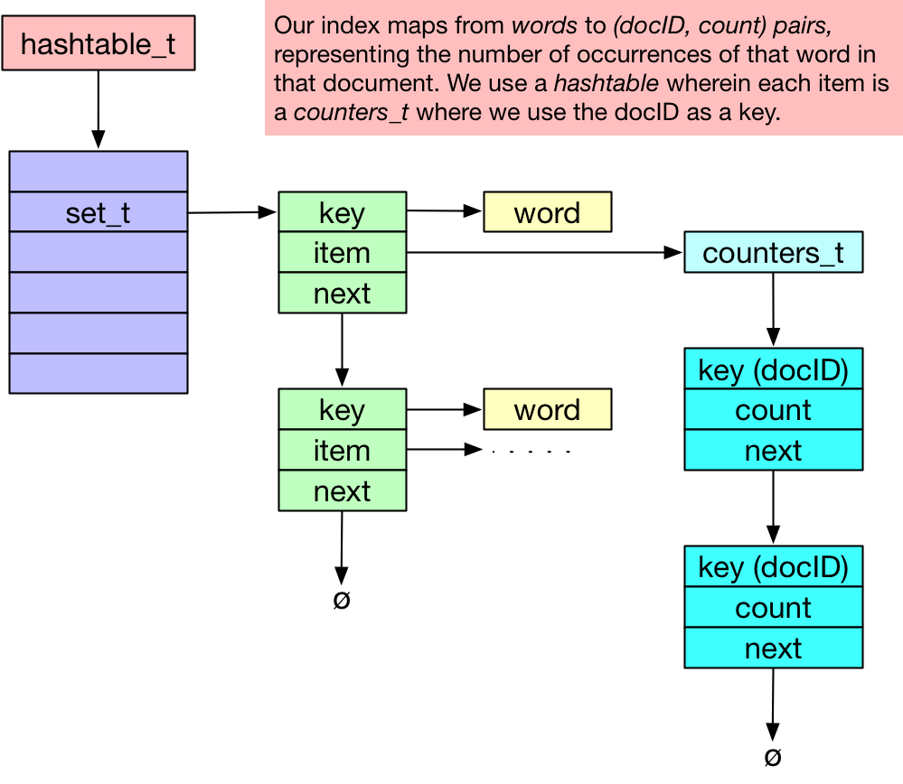

### Goals

* to reflect on our design principles and the Crawler
* to review the specs for the Indexer
* to explore the design of data structures for a search-engine index

## Key points in the Crawler design

What are some of the key ideas in the crawler design?

First, we ***separate application-specific logic from general-purpose utility modules.***  By leveraging general-purpose modules from Lab 3, coding the crawler-specfic logic is much cleaner and simpler than if it were woven in with the data-structure code.

> If your crawler weaves the logic of web crawling into the details of any of your data structures, you've missed this opportunity - your code is likely more complicated, more buggy, harder to debug, harder to test, harder to maintain, and much harder to reuse and extend.

Second, we note ***good data-structure design is key to successful projects.***

The design of the crawler remains simple because we chose two data structures - a *bag* for the set of pages yet to crawl, and a *hashtable* for the set of URLs already seen - that support the overall control flow.

On the other hand, when we get to the indexer and querier we may find that we need to adjust the code to provide slightly different functionality, or to factor out code that needs to be used by multiple components.
It's hard to have perfect foresight.

[Pragmatic Programmer Tip](http://pragprog.com/the-pragmatic-programmer/extracts/tips):
> **There are no final decisions**
>  No decision is cast in stone.
> Instead, consider each as being written in the sand at the beach, and plan for change.

Not all of the design decisions we made at the beginning of crawler made it through the implementation and testing to the final code.
Many times you'll say "it sounded like a good idea (design) at the time." The software development process is precisely that: a process.
It is not a programmer on a one-way street, but more like a chef crafting a new dish.
You have a plan that everyone agrees on, you begin to execute on that plan, and sometimes conditions change and unexpected interactions arise.
You have to handle them and and still get to the goal.

Finally, many of you have found that ***shell scripts can automate testing.*** It's far easier to test your crawler by writing a bash script to drive various test cases, or to examine the output for correctness, than to manually run a variety of tests for each new version of the code.
Even better, now's the time to use your `regress.sh` script from [Lab2]({{site.labs}}/Lab2).

> **"Use the Shell, Luke"**.
>  Know and use your tools.

## On to the Indexer!

The job of the `indexer` is to read the documents in the `pageDirectory` output by the `crawler`, build an inverted index mapping from words to documents, and write that index to a file.
(Later, the `querier` will read the index and use it to answer queries.)

Now is a good time to read Section 4 in *[Searching the Web]({{site.reading}}/searchingtheweb.pdf)*, the paper about search engines.

Today's Terminal [script](script1.txt) shows some of my classroom demos; it lists the files and structure of a complete and clean TSE directory.
Another Terminal [script](script2.txt) is a recreation of an `indexer` demo I ran in class; it shows how an `indextest.sh` might look.

### Indexer requirements

See the [Requirements spec]({{site.labs}}/Lab5/REQUIREMENTS.html).

### Activity

In today's [activity](activity.html) your group will discuss ideas for the indexer design.

<!-- Hide the rest of this page until activity period is over.-->

### Indexer design

You'll be writing out the Design Specs as part of Lab 5.
To help you get started, in this lecture we sketch out the key data structure and some high-level pseudo code.

#### Data structure: Inverted index

We need a data structure to represent the inverted index.
It's called an *inverted* index because it maps from words to documents, the opposite of a document (itself a sequence of words).

A hashtable is a great start, because we can look up a word in a hashtable in O(1) time.
But what is in the hashtable?
For each word, we need a list of documents.
(Not the documents themselves, silly, just the document IDs.) Actually, to enable us to later *rank* the matches, we'd also like to record how many times the given word appears in each document.

Consider the data structures we have handy: hashtable, set, bag, and counters.
(Oh, and tree.)  A *hashtable of countersets* is perfect to map from a word to a list of (docID, count) pairs.
See the diagram below:

We get to use three out of our four data structures: hashtable, set, and counters!

When processing a given document (identified by docID), consider each word; look up that word in the hashtable and retrieve a pointer to a `counters_t*` item; then use `counters_add()` on that item, using the docID as a key.

Your data-set iterators (like `hashtable_iterate()`) should be very useful for saving an index to a file, or for later loading an index from a file.

#### Indexer pseudocode

Very high-level description of the indexer and indextest.

`indexer`:

1. Process and validate command-line parameters
2. Initialize data structure *index*
4. index_build(directory, *index*)
5. index_save(file, *index*);
6. clean up data structures

`indextest`:

1. Process and validate command-line parameters
2. Initialize data structure *index*
3. index_load(file1, *index*)
4. index_save(file2, *index*)
5. clean up data structures

