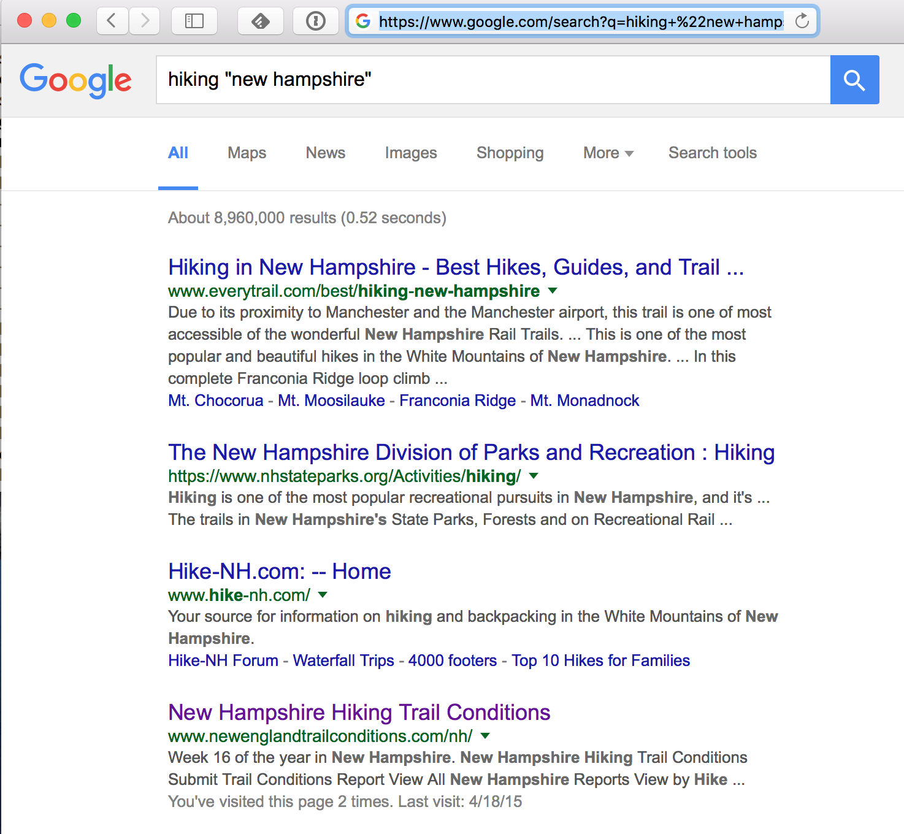

In the next series of Labs we will design, implement and test a command-line web-search tool called Tiny Search Engine (TSE) because it can be written in under **2000** lines of student-written C code (about 500 lines in each of four Labs 3-6).
Today we begin to discuss the concepts behind web search and the top-level design of TSE and its decomposition into three major components: crawler, indexer, and query.

In this lecture, we discuss some of the foundational issues associated with searching the web.
We also dicuss the overall architectural design of a more comprehensive search engine than TSE.

You should skim this classic paper about a web search engine:

> *[Searching the Web]({{site.reading}}/searchingtheweb.pdf),* Arvind Arasu, Junghoo Cho, Hector Garcia-Molina, Andreas Paepcke, Sriram Raghavan (Stanford University). ACM Transactions on Internet Technology (TOIT), Volume 1, Issue 1 (August 2001).

This paper gives insights into search-engine design.
You can skip the plots and deeper research material, but do your best to understand the text on the main components and design issues of a search engine.

### Goals

We plan to learn the following from today's lecture:

-   How does search engine like Google search the web?
-   A general search-engine architecture.
-   URLs, webpages, HTML, HTTP, and keywords.
-   'Talking' to the CS department webserver using HTTP.

<!-- Here's my Terminal [script](script.txt) for today. -->

### Searching the Web

How do you get information from the Web?
Searching the web is something we do every day with ease, but it's technically challenging to implement because of the scale of the web and because pages change at dramatically different rates.
As of April 12, 2014 there were **1.79 billion** publicly available webpages on the "indexed web" according to [one estimate](http://www.worldwidewebsize.com).
I just looked at that web site on April 17, 2018: the site says the indexed web now contains at least **4.86 billion pages!** Even that number likely to be an underestimate, because many organizations have lots of internal webpages that aren't indexed by the public search engines.

To get information about hiking in New Hampshire, I can use a search engine (such as Google) as an information retrieval system; it returns a list of links (URLs) to sites that have the keywords I specified embedded in them.
Conveniently, the search engine orders (ranks) the links so the most-relevant pages are near the top of the list.



------------------------------------------------------------------------

Google responded to my query in 0.52 seconds with 8,960,000 matches found!
How is that possible?
How does Google search more than 4 billion web pages in half of a second?
Surely, Google does not actually search those pages for each user's request.
Instead, it looks into a vast 'index' of the web, built earlier.
Given a new search term, it checks the index for pages known to have the word "hiking", and again for those with the phrase "new hampshire", and then intersects the two results to come up with a list.

How does Google rank the pages in the resulting list?
The solution is actually Google's 'secret sauce', the "page-rank algorithm" developed by Brin and Page when they were grad students.
(Although the original algorithm was published, Google continues to refine and tweak it and keeps the details secret.)

When and how does Google build that index?
And how does it find all the pages on the web?
Google's servers are constantly "crawling" the web: given one link (URL), download that page, find all the links in that page, and then go examine those pages - recursively.
As new (or updated) pages are found, they "index" each page by extracting the list of words used on that page, and then building a data structure that maps from *words* to *URLs*.

Later, a search query is broken into words, and each word is sought in the index, returning a set of URLs where that word appears.
For a multi-word query, they intersect the sets to find a set where all words appear.
Then they apply the page-rank algorithm to the set to produce a ranked list.

In April 2014, Google's website said its index filled over 100 million gigabytes!
**Check out this [nice video](https://www.google.com/insidesearch/howsearchworks/crawling-indexing.html) from Google explaining how search engine works.**


### General search engine architecture [Arvind, 2001]

Search engines like Google are complex, sophisticated, highly distributed systems.
Below we reproduce the general search engine architecture discussed in *[Searching the Web]({{site.reading}}/searchingtheweb.pdf).*

![General search engine architecture [Arvind, 2001]](searchenginearchitecture.png "General search engine architecture [Arvind, 2001]")

------------------------------------------------------------------------

The main components include parallel crawlers, crawler control (when and where to crawl), page repository, indexer, analysis, collection of data structures (index tables, structure, utility), and a query engine and ranking module.
Such a general architecture would take a significant amount of time to code.
In our TSE, we will implement a stripped down version of the main components.


### URLs, HTML, and keywords

Some terminology:

 * **URL**, short for *Uniform Resource Locator*, is used to specify addresses of webpages and other resources on the web.
An example is `http://www.dartmouth.edu/index.html`, which refers to the `HTTP` network protocol, the  `www.dartmouth.edu` server, and the `index.html` file on that server.
 * **HTML**. Most web pages are written in HyperText Markup Language (HTML).
For a quick tutorial on HTML see this *[Introduction to HTML](http://www.w3schools.com/html/html_intro.asp)*.
An HTML file is a text file with an `htm` or `html` file extension.
HTML pages can be created by tools or simply in an editor like emacs.
You will not need to write any HTML for this course.
 * **tags**. HTML uses "tags" to mark-up the text; for example `<b>this text would be bold</b>`.
Most tags are enclosed in angle brackets, like `<b>`, and most come in matching pairs marking the beginning and ending of a region of text to which the tag applies; note the `<b>` and `</b>` pair.

We are interested collecting URLs from HTML files.
The HTML tag that forms a link and references a URL is called an 'anchor', or 'a' for short.
The tag `<a>` takes parameters, most importantly the `href` parameter:

```html
<a href="http://www.dartmouth.edu/index.html">Dartmouth home page</a>
```

For the purpose of indexing the page, we need to find the 'words' in the page.
In most web pages, most of the content is outside the tags because the tags are there to format the content.
**For TinySearchEngine, we define keywords as being outside of tags.**

So when TinySearchEngine downloads a webpage of HTML source it needs to parse the page to extract URLs (so it can crawl those URLs) and identify the words that users might be interested in running queries for.

Parsing HTML can be challenging, especially because so many pages on the web don't follow the HTML standard cleanly.
We will provide you with a C function to parse the HTML.
(Feel free to write your own if you prefer).

For more information about HTML check out the old [HTML 4 specification](http://www.w3.org/TR/REC-html40/about.html) or the brand new [HTML 5 specification](http://www.w3.org/TR/html5/).

### Talk to a webserver using HyperText Transfer Protocol (HTTP)

The [HyperText Transfer Protocol (HTTP)](http://www.w3.org/Protocols/) is used between your client browser and the server to transfer HTML files.
HTTP itself is a very simple, stateless, request/response protocol that get its reliable underlying transport from TCP (Transmission Control Protocol) on top of IP (Internet Protocol).
(Go take CS60 to learn more about networking!)

The basic HTTP protocol is that the client sends a request called a `GET` and the server responds with a response.
Web servers 'listen' for requests on the well-known TCP port 80.

We have to first connect to the server and open up a reliable stream to host `www.cs.dartmouth.edu` at port 80.
We could write some fancy code to do this, but (in typical Unix style) there is already a tool we can use: `telnet`, a program that simply makes a TCP/IP connection to a given host and port, and connects our terminal's keyboard and screen to that connection so we can interactively write to the remote server listening at that port.

We can thus type an HTTP `GET` request by hand:

```
[cs50@flume ~]$ telnet www.cs.dartmouth.edu 80
Trying 129.170.213.101...
Connected to www.cs.dartmouth.edu.
Escape character is '^]'.
GET /~cs50/index.html HTTP/1.1           <== I typed this
HOST: www.cs.dartmouth.edu               <== and this
                                         <== and a blank line
HTTP/1.1 200 OK
Date: Wed, 19 Apr 2017 16:22:32 GMT
Server: Apache/2.4.23 (Fedora)
Last-Modified: Wed, 19 Apr 2017 14:57:28 GMT
ETag: "c50-54d863e326600"
Accept-Ranges: bytes
Content-Length: 3152
Connection: close
Content-Type: text/html; charset=UTF-8

<!DOCTYPE html>
<html>

  <head>
  <meta charset="utf-8">
  <meta http-equiv="X-UA-Compatible" content="IE=edge">
  <meta name="viewport" content="width=device-width, initial-scale=1">

  <title>CS50 Overview</title>
  <meta name="description" content="In Computer Science 50 you will learn how to design & build large,  reliable, maintainable, and understandable software systems.  In the process you will learn to program in C with Unix development tools.

. . .
```
```
      [<a href="https://canvas.dartmouth.edu/courses/14815">Canvas</a>]
      [<a href="https://piazza.com/dartmouth/spring2017/cosc050sp17/home">Piazza</a>]
      [<a href="/~cs50/Schedule.pdf">Schedule</a>]
      [<a href="http://www.cs.dartmouth.edu/~cs50/Logistics/">Logistics</a>]
      [<a href="http://www.cs.dartmouth.edu/~cs50/Lectures/">Lectures</a>]
      [<a href="http://www.cs.dartmouth.edu/~cs50/Reading/">Reading</a>]
      [<a href="http://www.cs.dartmouth.edu/~cs50/examples/">Examples</a>]
      [<a href="http://www.cs.dartmouth.edu/~cs50/Sections/">Sections</a>]
      [<a href="http://www.cs.dartmouth.edu/~cs50/Labs/">Labs</a>]
. . .
```

Try it yourself!
Make sure you hit carriage return twice after typing in
`HOST:  www.cs.dartmouth.edu`
since the HTTP protocol wants an empty line to indicate that you're finished.

The web server responds with a few lines of HTTP syntax; the first line reports status code `200` with human-readable equivalent `OK`.
The next few lines provide the date, the server version, the last-modified date for the file returned, and some other stuff describing the content as HTML.
After a blank line, the contents of the file we requested (the CS50 home page).
I snipped out most of it, but you can see the anchor tags that appear at the top of every CS50 page.
Notice the URLs for Canvas, Piazza, and links to other folders and files within the `~cs50` folder.

You happen to have access to the files used by this web server!
This server is configured to rewrite URLs of the form `/~user/...` to pathnames of the form `~user/public_html/...`.
So if you ssh to `flume` or any of the CS50 Unix machines you can `cd ~cs50/public_html/` and poke around at the HTML files there.

Most web pages will include many links, and sometimes will include the same link twice.
Furthermore, when exploring a set of web pages, those web pages often link to each other (for example, all the CS50 pages link to the CS50 'home', and that page links directly or indirectly to all of those pages).

The web is a "directed graph", not a tree.
Any effort to 'crawl' the web, therefore, must use something like breadth-first or depth-first search to explore the graph, avoiding the effort (and infinite loops!) that occur when encountering a link already found earlier in the crawl.

In our TinySearchEngine we will rely on `curl` (and the `libcurl` library) to retrieve webpages.

We can experiment a bit using the command-line version of `curl`.
Let's use `curl` to download the CS50 homepage count the number of URLs.
A crude approach would be to pipe the output of `curl` (i.e., the HTML from the web page) into `grep` and then count the lines.
(This approach will under-count if there are multiple `href` links on the same line.)  There are at least 17 links on that page.

```bash
[cs50@flume ~]$ curl -s http://www.cs.dartmouth.edu/~cs50/ | grep -i href | wc -l
17
```

## Activity

In today's [activity](activity.html) your group will start envisioning a design for the TSE Crawler.
