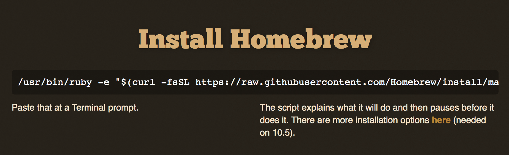

MacOS users are lucky because they get all the grace of a graphical interface with a large ecosystem of applications to make their computer productive, *plus they have access to the full power of Unix under the hood.*
Apple includes a lot of the core Unix commands and utilities, by default, but some of the commands you'll need (or want) in this course need to be added.
Some of these can be installed through the Apple developer's tool (`Xcode`), but lots of great open-source software needs to be installed separately.

The easiest way to install open-source software is through a 'package manager' (Linux users are likely already familiar with this concept!).
There are several package managers for MacOS, but I like the one called *[Homebrew](http://brew.sh)*.
It's easy to install and easy to use for installing other tools.

To get started, open a `Terminal` window and a browser window.
In your browser, visit the *[Homebrew](http://brew.sh)* site; copy the one-line command near the top of the page.

> Notice that it simply asks you to copy and paste a complex command into the `Terminal`.
You should never blindly copy-paste shell commands without understanding what the command will do to your computer!
In this case, the Homebrew page explains what it will do, and you're hearing it from me - this is a safe tool to install.
As far as I know. ;-)

Switch to `Terminal` and paste in that command.
The installation will download some files and start running.

If you've never run any of the 'developer'-oriented commands (like `gcc` or `make`) on your Mac before, you may see a popup like the following:

Click 'Install' to let Xcode do its thing.
It may be a large download.
This installer downloads all the command-line tools from Apple and installs them on your Mac.
You'll need these tools, and so does Homebrew.

When that completes, press Return in the Terminal window to allow the Homebrew installation to complete.
Then you can install new packages with a command line `brew install` followed by the package name (Homebrew actually calls them "formulas").
You can search for package names with `brew search`.

Later, periodically, you should `brew update` and then `brew upgrade` to keep all your software up to date.
I do this about once a month.

