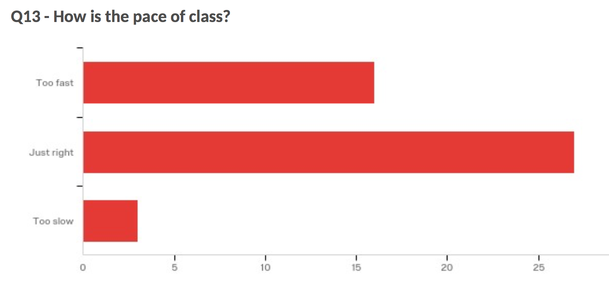
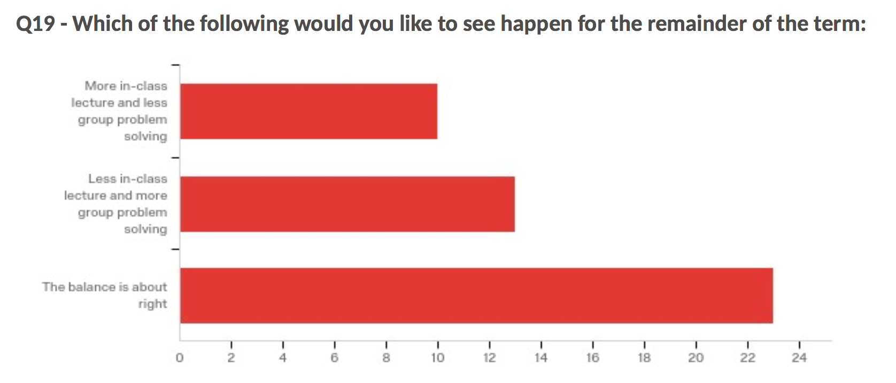

### Goals

* for students to identify how they can help improve their own learning
* for students to identify how they can help their group learn
* for the professor to identify how he can help students learn

## Activity

We discuss the feedback from the mid-term survey conducted by DCAL and the Instructional team.
Below are a few of the themes that came through loud and clear:

### Things we do well

* we compliment each other; we respect each other
* we *work together* to *learn together*
* we all contribute to understanding the task, understanding the material, and devising a solution
* we rotate partners and the 'point person' on activities
* we explain difficult concepts to others in our group
* we ask each other questions when we need help
* we ask questions to help guide others toward understanding
* we ask our Learning Fellow when we get stuck
* where we have different levels of experience, the more-experienced help the less-experienced.

### Things students can do

* I can pay more attention in lecture, and be ready to engage with the group activity
* I can attend regularly - and be part of my group
* I can participate more in my group activity
* I can encourage my group to work together rather than independently
* I can encourage each member to actively contribute
* I can rotate partners with whom I work
* I can encourage my group to rotate the 'point person' on activities
* I can ask more questions to help others understand the activity or the material
* I can make sure everyone's voice is heard
* I can create a groupme, slack, or other chat group to encourage group communication outside class
* I can get to know my team better - get together outside class
* I can read the lecture notes and labs more carefully
* I can help everyone by contributing answers on Piazza

### Things the professor can do

* he can clarify opportunities for help outside class
* he can vary how he conveys concepts in lecture: whiteboard work, live-coding programs, finished programs, in-class activities
* he can choose better (more interesting) examples
* he can explain pointers more clearly
* he can *slow down* the pace
* he can *speed up* the pace
* he can spend *more* time on in-class activities
* he can spend *less* time on in-class activities
* he can provide solutions to in-class activities
* he can ensure the lectures (and notes) cover everything needed for the labs
* he can streamline the lecture material - avoid 'lecture extras'
* he can clarify the expectations for each lab
* he can ensure faster turnaround on lab grades/feedback
* he can ensure section leaders are better prepared for sections
* he can reconsider the policies on attendance and assigned seating
* he can reconsider the assigment of groups at start of term

### Other observations

* the classroom furniture arrangement is not conducive to lecture
* in-class activities are helpful to some students
* out-of-class coding is how students learn best

