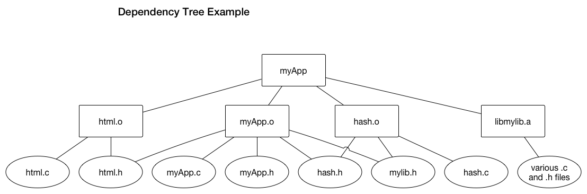

***This page written by Charles Palmer with examples from Ira Jenkins, but not updated for CS50 in 17S.***

The make utility concept
------------------------

Recall the compilation process we discussed in an earlier class.
Source files such as `weather.c` and `mycurl.c` are compiled into object files such as `weather.o` and `mycurl.o`, respectively.
Each object file contains a compiled system dependent representation of the source file.
The source files include the header files as part of the preprocessor phase of the compilation.
The linker links the object files together to resolve the function calls and global variable references between them, and then does the same with any needed library functions and variables, and produces an executable.
When invoked, the loader may then load the program into memory ready to run.

Up until now we have been typing out the `gcc` command lines to build and executable:

    gcc -Wall -pedantic -std=c11 -o weather weather.c mycurl.c

or more specifically, with our alias `mygcc`:

    mygcc -o weather weather.c mycurl.c

From now on we will use a better method for building systems.
We will use the `make` software which automates the building of software systems.

The `make` utility is essentially a command generator.
You provide it with a file that describes the interdependencies among the files that are used to build a particular *target*, which can be an executable or other kind of file (it doesn't have to be an executable!).
`make` builds a dependency tree of all the files that the requested target depends on, determines whether any of the files have changed, and then issues the commands shown in the `Makefile` that will bring any dependent files up to date and then the target itself.

You can view the [GNU documentation for `make`](http://www.gnu.org/software/make/manual/make.html), the manual pages for `make`, Steve Talbot's "oldie but goodie" book "*Managing projects with make*" which has been [updated](http://shop.oreilly.com/product/9780596006105.do) in 2004 by Robert Mecklenburg for GNU `make`, or any of the variety of online tutorials for `make` for more information.

Note: There are three popular `make`-like utilities for Java programs that you may encounter: Ant, Maven, and Gradle.
They share many of the same ideas as `make`, but with a decidedly Java orientation.
The bottom line is you can build Java systems with `make`, but these Java-specific alternatives are generally faster and offer more options.

Makefile basics
---------------

A `Makefile` (which is a plain text file that you write that the `make` utility interprets) describe a set of rules that capture the various actions that must be performed to build a target.
Targets can be specific files, most commonly an executable, a library, documentation, etc., or a more abstract thing, such as a specific system state, software repository inquiries, or any sequence of commands.
These rules are captured in the `Makefile` that is typically found in the source file directory.

Before we describe the `make` tool and give some examples of `Makefile`s lets talk about the reasons for moving to a more formal tool for compiling and linking our source code.

First, it is tedious to keep typing out a list of files - maybe a large number of files - upon which several programs, such as compilers and linkers, need to operate.
The `make` utility automates the compilation and linking process.
With `make` you specify all the files that make up your project, and how they fit together, and `make` takes care of the rest.
The key function of the `make` utility is that it determines if any files (for us, typically `*.c` and `*.h` files) have changed since the last build (where build here means the new executable that would be created by `make`).
If the target file you want make to build depends on any files which have been updated, make then ensures those files are recompiled.

Here's an example of such a dependency tree where the top of the tree represents the target `myApp` which depends upon those files below it, and they, in turn, depend upon the files below them.



In this example, the ovals represent files that the programmer created using an editor, downloaded from github, or received from another programmer.
The rectangles represent files that are the result of some processing that is performed upon one of the programmer-generated files.
Files that have a `.o` extension result from the compiler being run on a `.c` file that might use a `.h` file.
Some `.c` files might include several `.h` files because it uses functions defined in other `.c` files.
In addition, a `.c` file might call functions that are kept in a common library, so the `.c` file will include the `.h` file associated with that library.

When one of the files changes, how do you determine which ones needs to be recompiled to bring the target executable file up to date?
For example, if `hash.h` changes, then the files that depend on it must be rebuilt.
In this case, those would be `myApp.o` and `hash.o`, and then `myApp` itself.

This is both efficient and can save a significant amount of time.
The lecturer has worked on many projects where a complete rebuild for a large project took several hours.
You may find you are recompiling a project every few minutes because of the enhancements and fixes you are making.
Clearly, a good goal of developers of a large project is to only recompile the necessary files and not waste time recompiling those files that have not changed or have no dependencies on files that have changed.

So how do we translate this dependency tree into something `make` can handle?
The make utility uses files called "`Makefiles`" to guide its work.
We can describe the above dependency tree in [Makefile1](Makefile1.txt):

    #  Makefile1
    CC = gcc
    CFLAGS = -Wall -pedantic -std=c11
    UTILDIR=../util/
    UTILFLAG=-ltseutil
    UTILLIB=$(UTILDIR)libmylib.a
    UTILC=$(UTILDIR)file1.c $(UTILDIR)file2.c $(UTILDIR)file3.c $(UTILDIR)file4.c
    UTILH=$(UTILC:.c=.h)

    # luckily, make has comments too!

    myApp:  myApp.o html.o hash.o $(UTILLIB)
            $(CC) $(CFLAGS) -o myApp myApp.o html.o hash.o -lmylib

    myApp.o: myApp.c myApp.h html.h hash.h mylib.h
            $(CC) $(CFLAGS) -c myApp.c

    html.o: html.c html.h
            $(CC) $(CFLAGS) -c html.c

    hash.o: hash.c hash.h mylib.h
            $(CC) $(CFLAGS) -c hash.c

    $(UTILLIB): $(UTILC) $(UTILH)
            cd $(UTILDIR); make

    clean:
            rm -f *~
            rm -f *#
            rm -f ./myApp
            rm -f *.o
            cd $(UTILDIR); make clean

The `Makefile` includes a number of variable definitions and dependency rules.
Variables (where you see `` `=` '') can be used to define a list of directories to search, a set of files, the compiler and options to use, etc.
Make rules can be very simple or include complicated collections of shell commands.
The `make` utility supports defined variables, conditionals and some other very sophisticated features.

There are lots of things going on here.

First you see some `make` macro (constant) definitions:

-   `CC` - defines the name of the C compiler to be used and defaults to `cc` or `gcc`. In this case `gcc` is defined.
-   `CFLAGS` - defines a set of options passed to the compiler for all source file compilation.
In our case we specify the same options we have used throughout the course:
     `-Wall -pedantic -std=c11`.
     We could also specify other options, like the include path to include standard directories (`-I`) or debugging (`-g -ggdb`) if we wish.
-   `UTILDIR` - defines where the utility library is maintained
-   `UTILFLAG` - defines the switch to give to gcc to link with that library
-   `UTILC` - defines the list of `.c` files that are compiled into that library
-   `UTILH` - defines (via a very tricky macro expansion) the list of `.h` files that are used by the `.c` files that make up the library.

Similar to the shell, these macros can be used by specifying their name within `$(` and `)`, as in `$(CC)`.

After those definitions we see the target specifications.
The strings before the '`:`' are the *targets* of the `Makefile`.
They are the things that this `Makefile` can produce.
After the '`:`' is the list of files or other targets upon which that target "depends".
After that target and dependency line, the following lines *that begin with a tab character* are executed in order to bring that target "up to date."

Yes, the tab character is a little annoying, but that's the way it is.
An author expressed it well in the entry for `make` in Wikipedia:

> ``The syntax used by Make gives tab, a whitespace character, a different meaning from the space character.
This is problematic, since there is usually no visual difference between a tab and a number of space characters.
Thus, the syntax of make is often subject to criticism.''
>
> Citation: http://en.wikipedia.org

So, if you cut and paste a `Makefile` from these `html` lecture notes into an editor, you will likely have problems with the tab characters and make will not execute correctly.
Instead, if you click on the supplied link and download the file it will arrive intact.

In all of the example Makefiles presented here, actions start with a tab and not spaces.
All other formatting uses single spaces.

If you are in the same directory of a `Makefile` and enter "`make`", (with no parameters) the utility will read the Makefile, check the first target it reads, and, if it is "out of date", try to execute the commands that are specified.

Let's have an example.
Suppose the `html.c` file has changed since the last time `myApp` was built.
Then `myApp` is out of date.
If the Makefile is in the current directory, you can simply run `make` and these commands will be executed:

```bash
    gcc -Wall -pedantic -std=c11 -c hash.c
    gcc -Wall -pedantic -std=c11 -o myApp myApp.o html.o hash.o -lmylib
```

If any of the commands `make` is executing exits with a non-zero return code, `make` will then:

-   erase the current target it was working on
-   issue a message
-   exit with a non-zero return code without trying to build anything else

Often you will see other uses of macros in the `Makefile`.

Here's another sample `Makefile` which is a variation on the previous example.
[Makefile2](Makefile2.txt)

    # Makefile2
    CC = gcc
    CFLAGS = -Wall -pedantic -std=c11
    UTILDIR=../util/
    UTILFLAG=-lmylib
    UTILLIB=$(UTILDIR)libmylib.a
    UTILC=$(UTILDIR)file1.c $(UTILDIR)file2.comments $(UTILDIR)file3.c $(UTILDIR)file4.c
    UTILH=$(UTILC:.c=.h)

    # my project details
    EXEC = myApp
    OBJS = myApp.o html.o hash.o
    SRCS = myApp.c html.c hash.c myApp.h html.h hash.h

    # luckily, make has comments too!

    $(EXEC): $(OBJS) $(UTILLIB)
            $(CC) $(CFLAGS) -o $(EXEC) $(OBJS) $(UTILFLAG)

    $(OBJS): $(SRCS)
            $(CC) $(CFLAGS) -c $(SRCS)

    debug: $(SRCS)
            $(CC) $(CFLAGS) -g -ggdb -c $(SRCS)
            $(CC) $(CFLAGS) -g -ggdb -o $(EXEC) $(OBJS) $(UTILFLAG)

    $(UTILLIB): $(UTILC) $(UTILH)
            cd $(UTILDIR); make

    clean:
            rm -f *~
            rm -f *#
            rm -f ./myApp
            rm -f *.o
            cd $(UTILDIR); make clean


Here we see some new macros being used:

`EXEC` - which, defines the name of the executable file.

`SRCS` - which defines the list of source files.

`OBJS` - which defines the list of object files.

The Makefile default action when simply typing `make` builds the first target it finds, namely, the `myApp` executable.
If the programmer types `make debug` then `make` will build the first target (`myApp`) with the `-g -ggdb` options which allows the GNU debugger (`gdb`) to be run on the executable.

The example Makefile above defines the set of rules and dependencies to follow in order to build the executable `myApp`.
To make the `EXEC` you need the `OBJS`.
To get the `OBJS` you need the `SRCS`.

Another common target defined in makefiles is `clean`.
It is an example of a target that does not result in a new file being created or updated.
Here, the `clean` target has no dependencies and, thus, can be thought of as "always out of date".
If you enter "`make clean`" the `make` utility will skip to the `clean` target and, seeing no dependencies, proceed directly to the associated commands.

The idea of a "`clean`" target is a good one, but it's surprisingly hard to get right.
As is often the case with software, there are many little files that get created here and there, and often a developer will update the real targets and dependencies part of the `Makefile` without checking to see if he also needs to update the "`clean`" target's commands.
This is an example of *[Usman's law](http://www.cmcrossroads.com/article/make-clean-usmans-law).*
One solution to this challenge is described there as:

> *"Because of the pitfalls of `make clean`, the best way is not to
>  have a ` make clean`.
> The most reliable method is as follows:
>  1. The project Makefile must write its output to a sub-directory of the directory it is in.
>  2. To make clean you go up one directory and delete the entire hierarchy.
>  Then to make again you create a new directory, check out the sources, enter the directory and run make."*

`make` command usage
--------------------

Here are some of the command line arguments you can use with make.
To see all of them, use `man make`

`-f file`
use `file` as the `Makefile`

`-d`
produce debugging information while running

`-k`
while a particular target and the things that depend on it might have failed, continue trying to make the other dependencies of these targets anyway.

`-n`
Determine which commands need to be run, but don't actually execute any of them, just print them.

`-B`
unconditionally make all targets

### How does make respond?

Assuming you have no errors in your Makefile, when you invoke the make utility one of four things will happen:

1.  when it has nothing to do, make responds with the following and halts:

        'target' is up to date

2.  a bunch of commands are executed to try to do what you asked, continuing until either an error occurs (e.g., compile error) or all of the commands are executed.
3.  when it doesn't know what to do, make responds with the following and halts:

        Don't know how to make some-target

4.  sometimes if make can't decide what to do, it responds with nothing.
This is usually due to a missing component file.
For example, if you have

        target:  main.o

    and then enter `make target`, make will try to find some way to check if `main.o` is up to date. If

    -   a guess of how to make `main.o` depends upon a file that doesn't exist, or
    -   the file `main.o` does exist, or
    -   `target` either doesn't exist or is out of date with respect to `main.o`

    then the `make` command will either remain totally silent (old systems) or respond with something like:

        make: *** No rule to make target `mainline.o', needed by `target`.  Stop.

More on macros
--------------

Any symbol that is defined in a Makefile like this

    NAME = VALUE

is called a macro.
Once defined, you can expand them using

    ... $(NAME) ...

Any environment variables that were set prior to your running make are automatically made available during the execution of make: [Makefile4](Makefile4.txt)

    # Makefile 4
    top:    middle
            @echo "building the top"

    middle: whoami
            @echo "building the middle"
    whoami:
            @echo "make invoked by User "$(USER)" running shell "$(SHELL)" ."


```bash
    [ccpalmer@swamp] $ make -f Makefile2
    make invoked by User ccpalmer running shell /bin/sh .
    building the middle
    building the top
    [ccpalmer@swamp] $ 
```

The make utility also provides some useful builtin macros:

`$@`
name of the current target

`$?`
The list of dependencies that are newer than the target

```bash
    target:  a.c  b.c  c.c 
            @echo "working on "$@" due to updates to "$?" [ccpalmer@swamp] $ touch target
    [ccpalmer@swamp] $ touch a.c c.c
    [ccpalmer@swamp] $ make -f Makefile3
    working on target due to updates to a.c c.c
    [ccpalmer@swamp] $ 
```

Note, of course, that the target doesn't necessarily represent a file, but by using "touch target" we force creation of an empty file with the current timestamp.

`D`
directory path, $(@D), $(\<D)

`F`
file name, $(@F), $(\<F)

    target.x:  a.c  b.c  c.c
            @echo "working on "$@" due to updates to "$?
            @echo "Dollar@ with D is : ["$(@D)"]"
            @echo "Dollar@ with F is : ["$(@F)"]"
    [ccpalmer@swamp] $ touch target.x
    [ccpalmer@swamp] $ touch b.c c.c
    [ccpalmer@swamp] $ make -f Makefile3
    working on target.x due to updates to b.c c.c
    Dollar@ with D is : [.]
    Dollar@ with F is : [target.x]
    [ccpalmer@swamp] $

Suffix rules
------------

To further reduce the complexity of your `Makefiles`, you can use make's suffix rules.
By suffix in this context, we're talking about filetypes or extensions (e.g., `.c`, `.h`, `.o`, etc.).
These rules are defined in the `Makefile` and show a default way of making a file with one suffix into a file with another suffix.
For example, you might have in all of your makefiles some suffix rules like these:

    .SUFFIXES     :   .o  .c  .s

    .c.o    :
            $(CC) $(CFLAGS) -c $<

    .s.o    :
            $(AS) $ASFLAGS) -o $@ $<


The `.SUFFIXES` line identifies which suffixes make should consider as special.
After that, you see lines with two suffixes as a target, followed by statements of how to turn files with the first suffix into files with the second.

In essence, these suffix rules provide a default means of producing one kind of file from another.
If these defaults are sufficient, you won't need to define specific targets for these targets.

There are also some more builtin macros that are only available in suffix rules:

`$<`
The name of a dependency file, derived as if selected for use with an implicit rule.

`$*`
The basename of the current target.
That is, the name of the current target without its suffix.

More cool make ideas (from [Ask Mr Make](http://blog.jgc.org/2010/01/update-list-of-my-gnu-make-articles.html), ccp, & others)
------------------------------------------------------------------------------------------------------------------------------

### Printing out make variables

Sometimes you need to know what $X is while the makefile is being run.
An easy way to print out its value is to add the rule

    MYVAR = 42
    target:
            @echo "at the top"
            @echo "it is = "$(MYVAR) 
           
    print-%:
            @echo $* = $($*)[cs50@tahoe] $ make -f p.mak
    at the top
    it is = 42
    [cs50@tahoe] $ make -f p.mak print-MYVAR
    MYVAR = 42
    [cs50@tahoe] $ 

Special capabilities

-   dont forget you can include shell commands in the makefile
-   makefiles can invoke other makefiles!
-   makefiles can create all the other makefiles for a system (see the [postfix project](http://www.porcupine.org/postfix-mirror/start.html) for an excellent example).

### Non-compilation makefiles

You can use makefiles to solve many of your daily challenges involving a sequences of dependent actions:

-   running test shell scripts during development and regression testing (we will do this!)
-   creating documents with LaTeX (see the following example)
-   maintaining webpages (staging and live directories), including verifying accessibility compliance, style rules, etc.
-   automated documentation generation, including literate programming
-   sourcecode management

Large example Makefile
----------------------

Here are some excerpts of the Makefile we use to build, test, and run our server for the Project.

```make
    #======================================
    # Makefile for app server 
    #
    # Author: Ira Ray Jenkins
    # Date: Sun May 11, 2014
    # Note: Gnumake is assumed
    #======================================
    # directories
    INC_DIR = .
    SRC_DIR = src
    BLD_DIR = build
    BIN_DIR = bin
    TST_DIR = test

    # compiler and flags
    CC = gcc
    CFLAGS = -std=c11 -Wall -pedantic -g
    LIBS = -lcrypto -lgd
    INCS = -I$(INC_DIR)/ -I$(SRC_DIR)/

    # what we're doing
    HDR = $(INC_DIR)/app.h
    SRC = app.c file.c hash.c genstack.c
    OBJ = $(patsubst $(SRC_DIR)/%.c,$(BLD_DIR)/%.o,$(SRC))
    BIN = $(BIN_DIR)/appd

    TST_BINS = $(BIN_DIR)/app_test $(BIN_DIR)/genstack_test

    # these targets do not produce real "targets"
    .PHONY: clean setup test server start-server stop-server client\
            start-client stop-client

    # ignore errors from these targets
    .IGNORE: stop-server

    # Default target - the server
    $(BIN): setup $(OBJ) $(HDR)
        @echo "Building ur..."
        $(CC) $(CFLAGS) $(INCS) -o $@ $(OBJ) $(LIBS)

    # app_test
    $(BIN_DIR)/app_test: setup $(BLD_DIR)/app_test.o $(BLD_DIR)/file.o \
                                 $(BLD_DIR)/genstack.o $(HDR)
        @echo "Building $(@)..."
        $(CC) $(CFLAGS) $(INCS) -o $@ $(BLD_DIR)/app_test.o $(BLD_DIR)/file.o \
                                 $(BLD_DIR)/genstack.o $(LIBS)
        @$(BIN_DIR)/app_test

    # genstack_test
    $(BIN_DIR)/genstack_test: setup $(BLD_DIR)/genstack_test.o $(BLD_DIR)/genstack.o $(HDR)
        @echo "Building $(@)..."
        $(CC) $(CFLAGS) $(INCS) -o $@ $(BLD_DIR)/genstack_test.o $(BLD_DIR)/genstack.o $(LIBS)
        @$(BIN_DIR)/genstack_test

    # appc
    $(BIN_DIR)/appc: setup $(BLD_DIR)/appc.o $(HDR)
        @echo "Building $(@)..."
        $(CC) $(CFLAGS) $(INCS) -o $@ $(BLD_DIR)/appc.o $(LIBS)

    # general rule for .o files with a .h
    $(BLD_DIR)/%.o: $(SRC_DIR)/%.c $(SRC_DIR)/%.h $(HDR)
        @echo "Building $(@)..."
        $(CC) $(CFLAGS) $(INCS) -c -o $@ $< $(LIBS)
        @echo

    # general rule for .o files with no .h
    $(BLD_DIR)/%.o: $(SRC_DIR)/%.c $(HDR)
        @echo "Building $(@)..."
        $(CC) $(CFLAGS) $(INCS) -c -o $@ $< $(LIBS)
        @echo

    $(BLD_DIR)/%.o: $(TST_DIR)/%.c $(HDR)
        @echo "Building $(@)..."
        $(CC) $(CFLAGS) $(INCS) -c -o $@ $< $(LIBS)
        @echo

    test: $(TST_BINS)

    client: $(BIN_DIR)/appc

    start-client: client
        @$(BIN_DIR)/appc 4 5 pierce.cs.dartmouth.edu

    stop-client:
        @killall -q appc

    server: $(BIN)

    start-server: $(BIN)
        @$(BIN)&

    stop-server:
        @killall -q appd

    setup:
        @mkdir -p $(BIN_DIR)
        @mkdir -p $(BLD_DIR)

    # clean up the directories
    clean: stop-server
        rm -rf *# core* *.png $(BLD_DIR) $(BIN_DIR) test/*log *.log
```

Notes on the above:

1.  Normally make will echo each command it is running to the screen.
By preceding a command with an '@' you can prevent this echoing, but the command will run normally.
2.  `patsubst` changes strings that match the first arg, into strings that look like the second arg, with the third arg providing the list of strings.(Gnumake)
3.  `.PHONY:` provides a list of targets that don't correspond to actual files.
For example, by using this directive in a makefile with a target `clean`, then even if there is a file named `clean` on the system it will not be considered and the `clean:` target will be made when needed or requested.
4.  `.IGNORE:` provides a list of targets for which errors should be ignored

