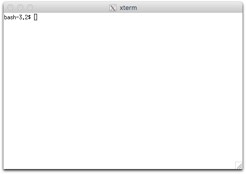
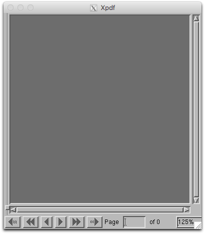
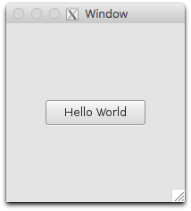

On MacOS X, **XQuartz** enables you to use the X11 window system.

#### 1. Install XQuartz application
Here we provide two ways to install XQuartz application.
You could either install from official website or install with Homebrew.
In general, we recommend you to use Homebrew to install and manage packages on MacOS X.

  1. Download and install directly from [XQuartz](https://www.xquartz.org/).
  2. Install with **[Homebrew](http://www.cs.dartmouth.edu/~cs50/Resources/Homebrew.html)**.  There are two steps:
    1. **[Homebrew Cask](https://caskroom.github.io/)** is an extension of Homebrew. It installs GUI applications under the framework of Homebrew. Install **Homebrew Cask** with command `brew tap caskroom/cask`.
    2. Install XQuartz with command `brew cask install xquartz`.

#### 2. Validate X11 installation on your Mac
Open XQuartz application from the launchpad on your Mac to see if it is installed correctly.
It will open an `xterm` window.
If that does not work immediately, try restarting your computer.


#### 3. Validate X11 connection to remote server
Next, try running an X11 application on one of the CS50 Unix servers.
Log into a CS50 Unix server and launch an X11 application, such as `xclock` or `xemacs`.
For a little fun, try `xeyes`.

```
ssh -X username@flume.cs.dartmouth.edu
xpdf
```
The `-X` option to `ssh` sets up X11 forwarding for `ssh` connections.
That is, it sets up a secure tunnel between the program (like `xclock`) running on the server and the XQuartz application on your Mac; the program can create windows, buttons, menus, etc.; all the information flows through the ssh tunnel to XQuartz, which renders the windows on your Mac.
It works with all CS50 Unix servers.
`xpdf` will open a pdf viewer in X windows system on your local computer.
Here's an xpdf window.


**Note**

A warning may show up saying `$Home/.Xauthority does not exist` if it is your first time to use X11.
The `Xauthority` file will be configured automatically at the first run.
From then on, the warning should not appear.

**Reference**

[Using X-windows](https://uit.stanford.edu/service/sharedcomputing/moreX)

## Your first GTK+ application

If you need a GUI (graphical user interface), we recommend the `gtk+` library, which is a popular UI toolkit for the X11 window system.
There are two versions of `gtk+` libraries: `gtk+-2`(version 2) and `gtk+-3`(version 3).
`gtk+-2` is still alive but we recommend the latest version, `gtk+-3`.
Both versions are ready to use on our CS50 Unix servers, so you need to specify the version to work with at compile time.

The [gtk-example.c](gtk-example.c) example program, below, uses `gtk+-3`.
It opens a window with a simple button, as shown below the code.
Feel free to use!

```c
/*
 * filename: gtk-example.c
 * source: https://developer.gnome.org/gtk3/stable/gtk-getting-started.html
 */
#include <gtk/gtk.h>

static void print_hello (GtkWidget *widget,  gpointer   data) {
    g_print ("Hello World\n");
}

static void activate (GtkApplication *app, gpointer user_data) {
    GtkWidget *window;
    GtkWidget *button;
    GtkWidget *button_box;

    window = gtk_application_window_new (app);
    gtk_window_set_title (GTK_WINDOW (window), "Window");
    gtk_window_set_default_size (GTK_WINDOW (window), 200, 200);

    button_box = gtk_button_box_new (GTK_ORIENTATION_HORIZONTAL);
    gtk_container_add (GTK_CONTAINER (window), button_box);

    button = gtk_button_new_with_label ("Hello World");
    g_signal_connect (button, "clicked", G_CALLBACK (print_hello), NULL);
    g_signal_connect_swapped (button, "clicked", G_CALLBACK (gtk_widget_destroy), window);
    gtk_container_add (GTK_CONTAINER (button_box), button);

    gtk_widget_show_all (window);
}

int main (int argc, char **argv) {
    GtkApplication *app;
    int status;

    app = gtk_application_new ("org.gtk.example", G_APPLICATION_FLAGS_NONE);
    g_signal_connect (app, "activate", G_CALLBACK (activate), NULL);
    status = g_application_run (G_APPLICATION (app), argc, argv);
    g_object_unref (app);

    return status;
}
```



**Compiling with gtk+**

Use the following command to compile [gtk-example.c](gtk-example.c):

```bash
gcc `pkg-config --cflags gtk+-3.0` -o gtk-example gtk-example.c `pkg-config --libs gtk+-3.0`
```

`pkg-config --cflags gtk+-3.0` will produce a list of header paths you might use in your application and `pkg-config --libs gtk+-3.0` will produce a list of library paths.
(Notice the use of back-ticks for bash command substitution.) A more detailed explanation can be found in references below, which include a well-written tutorial.

**Reference**

[gtk documentation](http://www.gtk.org/documentation.php)

[Getting Started with GTK+](https://developer.gnome.org/gtk3/stable/gtk-getting-started.html)

[Compiling GTK+ Applications](https://developer.gnome.org/gtk3/stable/gtk-compiling.html)
